# Chapter 0: Introduction

Constellation is a graph-based data analysis application enabling data
access, federation and manipulation capabilities across large and
complex data sets. While it provides significant capability out of the
box, it has been designed with extensibility and modularity in mind.
There are two prominent ways of extending Constellation, namely through
its **views** or by creating **plugins**. Views appear as windows in the
application and provide visualisation of and interaction with the graph.
Plugins perform operations on the graph. In addition, there are several
other ways that Constellation can be customised, including defining new
attributes or even your own custom graph.

This guide will introduce you to the most common ways to customise
Constellation in order to solve domain-specific problems. Each chapter
will introduce a new concept interspersed with a series of practical
exercises. These exercises will build on each other to form a complete
solution to a hypothetical scenario.

**Assumed Knowledge**

In order to effectively extend Constellation, you should have knowledge
in the following areas:

-   Familiarity with using Constellation for data analysis.

-   Experience with Java and preferably JavaFX.

-   Familiarity with representing data as a graph.

-   Basic experience with NetBeans development.

**Document Conventions**

Throughout this training document we will use the following conventions:

**TIP**: This is a tip. Tips describe features or concepts that are nice 
to know but not crucial for a good understanding of the rest of the 
material.

**This is an important fact. Important facts describe features or
concepts that are crucial to successful Constellation development.**

```
This is a code block. Code blocks contain valid Java code that will be
needed to complete the development tasks in this document. In general,
you can complete the development tasks by copy-and-pasting these code
blocks into the skeleton classes contained in the exercises module.
```

**Required Files**

Clone the **Constellation** and **Constellation Training** repositories.

The constellation repository contains the source code to build the
Constellation application which we will be developing against. The
Constellation Training repository contains source code for all exercises
covered in this tutorial alone with solutions.

**The Scenario**

Our scenario takes place as a pandemic sweeps across the globe. We will
use Constellation to track the spread of a multitude of deadly diseases
in order to identify strategies to curb the various outbreaks. To aid in
this mission, we have three data sets at our disposal:

-   *Cities*: a table of cities along with their populations and
    geographic coordinates.

-   *Flights*: a table of flight paths between cities along with flight
    information.

-   *Outbreaks*: a table holding the current infection levels for each
    infected city.

There are two modules provided with this training: 'exercises' and
'solutions'. You will be creating a NetBeans module suite for each,
based on the provided Constellation platform. The exercises module
provides skeleton code for you to work from throughout this tutorial,
whilst the solutions module provides a completed version of all
functionality.

The cities, flights and outbreaks data sets can be found in the provided
modules under the release/modules/ext/ folder. You will need to look at
this directly for the first exercise; after that it will be accessed
through code.

## Exercise 0.1: Exploring the Data

Gaining familiarity with your data is a helpful first step before
approaching the problem as a Constellation development task. We will
import our datasets using the **Delimited File Importer** in
Constellation in order to explore the data and determine how to best
represent it as a graph.

1.  Import the Cities table into your graph, with each row representing
    a node. Attributes such as 'Geo.Latitude' and 'Geo.Longitude' will
    already exist in the schema, while attributes such as 'Population'
    will need to be created. As each node will represent a city, you
    should use the city name as the primary key by mapping it to the
    'Identifier' attribute.

2.  Import the Flights table into your graph, with each row representing
    a transaction. These transactions will represent flights between
    cities, and so should connect existing city nodes on your graph. You
    should use the departure city as the source node 'Identifier' and
    the arrival city as the destination node 'Identifier'.

3.  Import the Outbreaks table into your graph, enriching existing nodes
    with new attribute information in each row.

Now that you have a representation of the data as a graph, try answering
the following questions:

-   How many diseases exist?

-   What is the most infected city?

-   What is the average number of flights out of each city?

# Chapter 1: Development Environment

Constellation is built in Java 21 on top of the NetBeans platform, taking
advantage of its module and windowing systems, among others. For
information on how to install and configure Java 21 or NetBeans, refer to
instructions on the Azul and Apache Netbeans websites.

## Exercise 1.1: Setting up your Development Environment

### 1.1.1: Creating a Module Suite

NetBeans allows related code to be grouped into **modules**, which can
be added or removed from a NetBeans platform as required. These modules
are stored in and managed by a **module suite**.

1.  Click on *File \> New Project*, then select *Module Suite* under the
    *NetBeans Modules* sub-category of *Java with Ant*. Click *Next*.

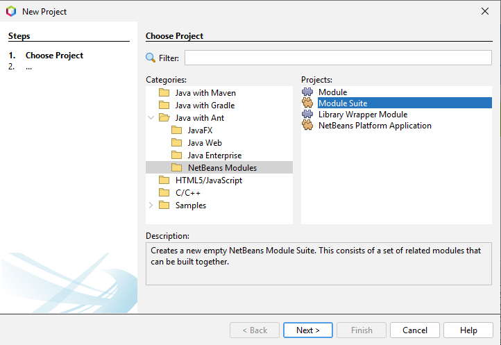{ width=80% }

2.  Enter 'TrainingExercises' as the project name for your module suite.
    Specify a convenient project location of your choice.

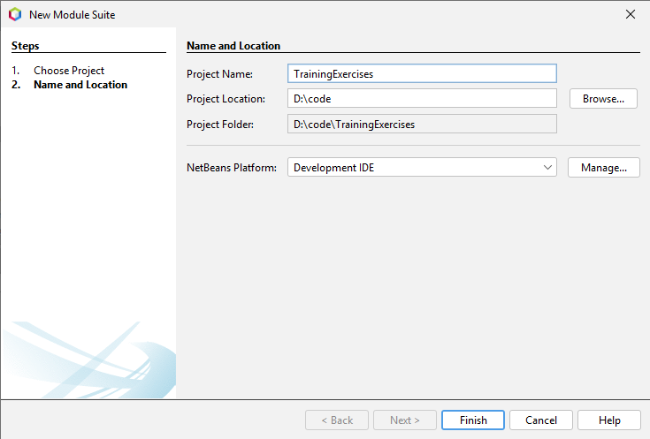{ width=80% }

3.  Click Finish.

### 1.1.2: Configuring a Module Suite

You can configure a module suite by right clicking it and choosing
*Properties*. Let's add Constellation as a module dependency to our
newly created Training module.

1.  Within the properties window, select *Libraries*.

2.  Deselect all modules except platform.

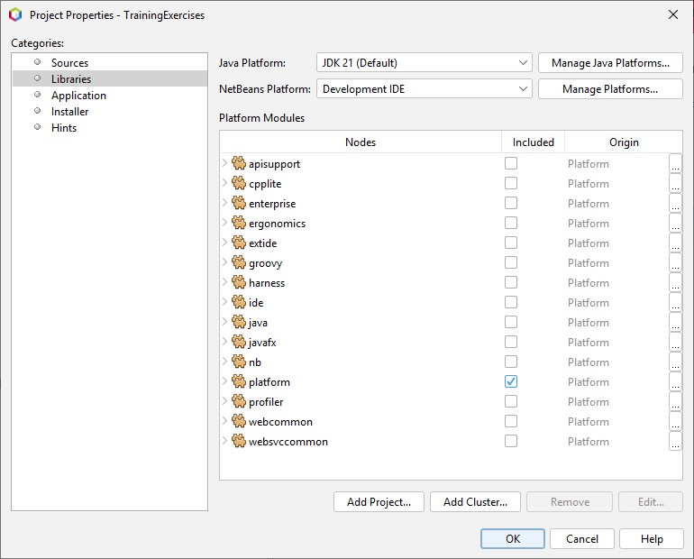{ width=80% }

3.  Select *Add Project* and browse to the Constellation module suite.

{ width=80% }

4.  Click *OK,* to finalise configuration of your module suite.

### 1.1.3: Running a Project

Verify that Constellation runs by right clicking on your new module
suite and selecting *Run*.

{ width=40% }

**TIP**: Pressing the F6 key is a shortcut for running your main project. 
When you have multiple projects open, you can specify the main project by
right-clicking on it and selecting "Set as Main Project". This simply
means that NetBeans can make assumptions about what to clean, build, or
run when you don't specify otherwise.

Once Constellation has finished loading, you should be presented with
the Constellation Welcome Page.


### 1.1.4: Accessing JDK Internals

While Constellation is running, try opening a new graph and see what 
happens. What you would expect to happen is Constellation simply opens a 
new graph, but instead you get a number of exceptions being thrown. Why 
is that? To find that out, close Constellation and take a look at the logs 
in the output window.

In the output window, near the top of the logs for that run of 
Constellation, you'll see this exception:

```
java.lang.reflect.InaccessibleObjectException: Unable to make field 
    transient java.net.URLStreamHandler java.net.URL.handler accessible: 
	module java.base does not "opens java.net" to unnamed module @27fa135a
```

As of Java 17, JDK internals are strongly encapsulated, meaning that 
external modules can no longer access internal APIs. Constellation at 
present though requires access to some of these internals. Without that 
access, these kinds of exceptions get thrown. There are ways to get around 
that but we won't go into that in any detail here. You can refer to 
JEP-403 online for more information.

The key thing to note here is that Constellation has opened up a number of 
internals in order to work (note that Constellation was first written 
before Java 17) and so any module suites that have Constellation as a 
module dependency will also require these opened. This includes our newly 
created module suite.

1.	Expand your module suite, expand *Important Files* and select 
	*Project Properties*.

2.	Add the following code to the bottom of the file:
```
run.args.extra=-J--add-opens=java.base/java.net\=ALL-UNNAMED \
               -J--add-opens=java.base/java.security\=ALL-UNNAMED \
               -J--add-opens=java.desktop/javax.swing\=ALL-UNNAMED \
               -J--add-opens=javafx.base/com.sun.javafx.event\=ALL-UNNAMED \
               -J--add-exports=java.base/java.net\=ALL-UNNAMED \
               -J--add-exports=java.base/java.security\=ALL-UNNAMED \
               -J--add-exports=java.base/java.lang\=ALL-UNNAMED \
               -J--add-exports=java.desktop/sun.awt\=ALL-UNNAMED \ 
               -J--add-exports=java.desktop/sun.java2d\=ALL-UNNAMED \
               -J--add-exports=javafx.base/com.sun.javafx.event\=ALL-UNNAMED
```

3.	Save the file and then clean and build your module suite.

Verify it all works by running your module suite again. When you open a 
new graph this time, no exceptions should be thrown.

### 1.1.5: Creating a Module

In order to start writing code, we first need a module to store it in.

1.  Expand your module suite, right click on *Modules* and select the
    *Add New...* option.

2.  Enter *EnvironmentTestModule* as the project name for your module,
    then click *Next*.

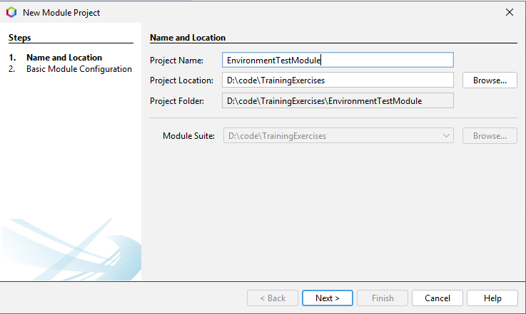{ width=80% }

3.  Enter "org.company.test" as code name base and module display name
    and "Environment Test Module" for your module display name, then
    click ***Finish***.

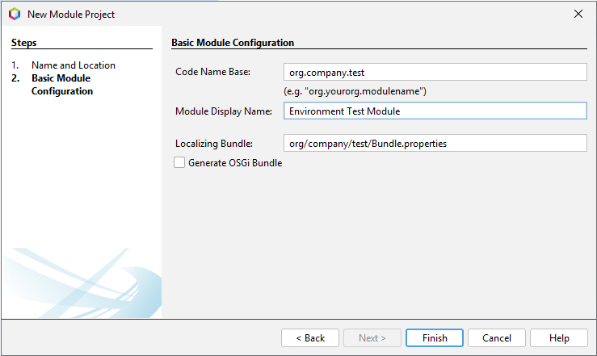{ width=80% }

4.  You should now see your new module in the *Modules* directory of
    your module suite. To open your new module, right click it and
    select *Open Project*.

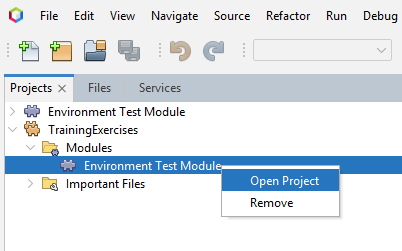{ width=80% }

### 1.1.6: Configuring a Module

Similar to a module suite, you can configure a module by right clicking
an open module and selecting *Properties*.

1.  Since we are working in Java 21, it is always a good idea to ensure
    that your module is Java 21 compliant. This can be achieved by
    clicking *Sources* and setting the *Source Level* to 21.

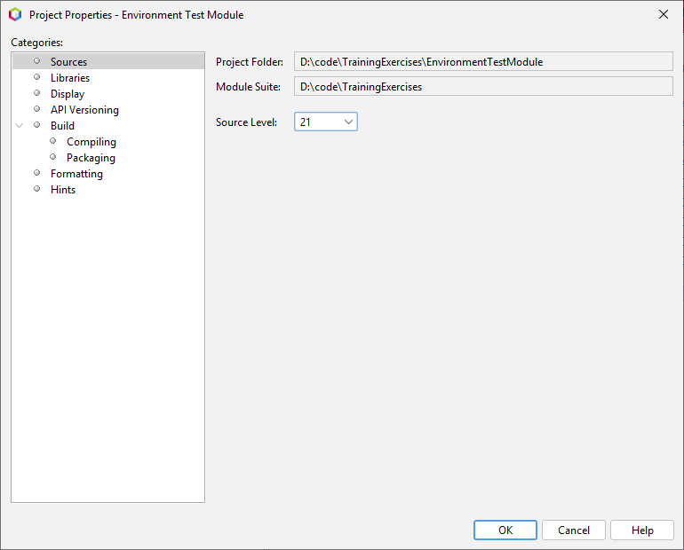{ width=80% }

2.  You can also add or remove dependencies for your module under the
    *Libraries* category. At this stage we have no required dependencies
    but we will visit this page later in the section.

{ width=80% }

3.  You can give your module a name, category and description under the
    *Display* category.

{ width=80% }

4.  Finally, once you have some code in your module, you can manage
    whether packages are public or private to other modules under the
    *API Versioning* category. You can also increment the version number
    of your module here.

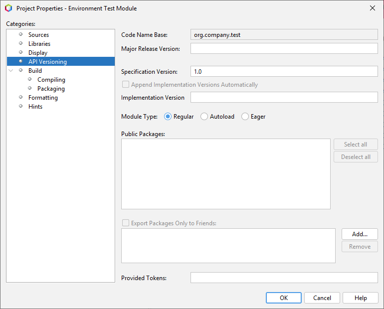{ width=80% }

5.  Click *OK* to finalise configuration of your module.

### 1.1.7: Testing your Environment

To make sure your environment is configured correctly, let's try adding
some code to it and observing the output.

1.  Right click on the root package your module (in the *Source*
    *Packages* directory) and select the *New \> Action...* option.

2.  Leave the action type as Always Enabled and click Next.

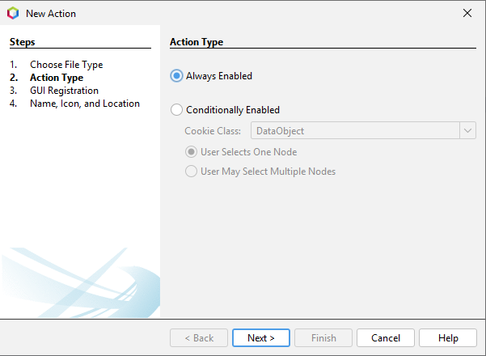{ width=80% }

3.  Set the *Category*, *Menu* and *Position* as shown below and then
    click *Next.*

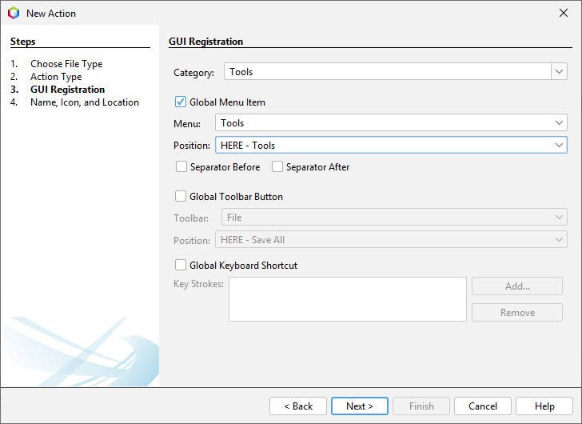{ width=80% }

4.  Set the *Class Name* and *Display Name* as shown below and then
    click *Finish*.

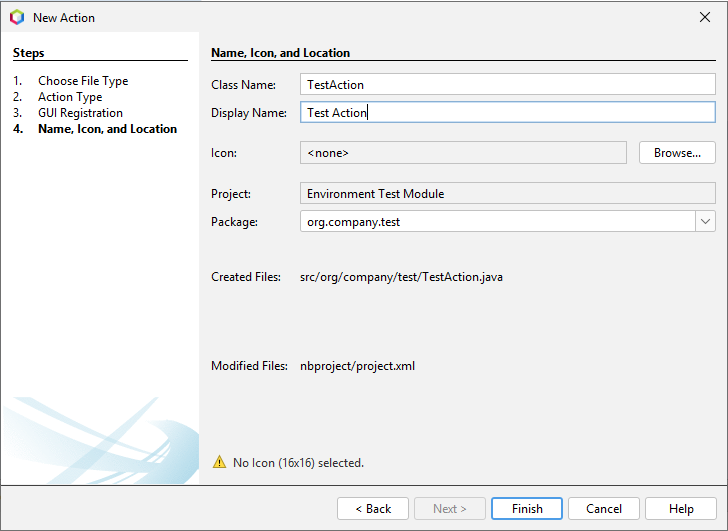{ width=80% }

5.  This will create a class called **TestAction**. Paste the following
    code inside this class:

```java
@Override
public void actionPerformed(final ActionEvent e) {
    System.out.println("Your Environment is Configured Correctly!");
}
```

6.  Run your project, and find the action you just created (remember you
    can search for it using the quick search bar) and run it. Observe
    the message printed to the NetBeans console.

**TIP**: Here are some useful NetBeans shortcuts:

Auto-complete (Ctrl+Space): Standard auto-complete as found in most
IDEs.

Fix Imports (Ctrl+Shift+I): This will add import statements for classes
that you have used in your code. An efficient way to work through this
tutorial is to copy and paste the code snippets from the document into
your IDE. If you take this approach, fixing the imports will be required
to make the code compile.

Auto-format (Alt+Shift+F): The most efficient way to work through this
tutorial is to copy-paste the code blocks from the document to the
exercise classes. Use can use auto-format to fix the formatting of these
code blocks.

Insert Code (Alt+Insert): Netbeans provides a number of useful shortcuts
for implementing common code patterns such as constructors, getter and
setter methods, and equals and hashcode methods.

Copy Code (Ctrl + Shift + Up, Ctrl + Shift + Down): Copies the selected
block of code (or single line if there is no selection) to the line
above or below.

Move Code (Alt + Shift + Up, Alt + Shift + Down): Moves the selected
block of code (or single line if there is no selection) to the line
above or below.

Comment (Ctrl + /): Comment or uncomment the selected block of code (or
single line if there is no selection).

NetBeans will also provide useful hints in the margins which can be
clicked for further options. These include automatic code generation and
import resolution.

### 1.1.8: Import the Training Module

Right click on the *Modules* directory inside your module suite and
select *Add Existing...*. Browse to the TrainingExercises module as
displayed below and click *Open Project*.

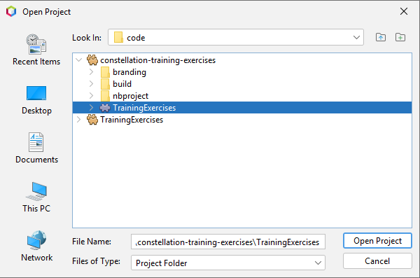{ width=80% }

As the module you are importing currently belongs to another module
suite, NetBeans will warn you that it will be removed from its existing
module suite:

{ width=80% }

Click *OK* to confirm.

To ensure you have access to the classes provided by Constellation, we
should add all of its modules as dependencies. Recall from **1.1.5**
that this can be achieved by clicking *Add Dependency...* under the
*Libraries* category within your module's properties.

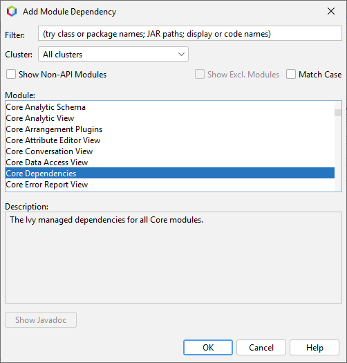{ width=80% }

Select all modules beginning with "Core" (you can hold the shift key to
select a range) and click *OK* to add them as dependencies of your
module.

**TIP**: You can follow the same process of creating and configuring a module
suite described in this chapter for the training solutions.

# Chapter 2: Data Access

While importing data with the Delimited File Importer is appropriate in
many circumstances, it has a number of restrictions that make it
inflexible for certain data formats:

1.  There is only a small, finite set of delimited file types that the
    importer accepts. While there is a mechanism by which new file
    formats can be programmatically added, only those that can be
    intuitively translated to a tabular form are suitable. Some file
    formats have no tabular interpretation.

2.  In addition to requiring data in a tabular form, the Delimited File
    Importer imports each row as an independent record. Many data sets
    have rows/records that depend on each other, meaning the Delimited
    File Importer will not interpret these relationships to a graph.

3.  The Delimited File Importer provides a fixed number of transforms
    that can be performed on your data as it is ingested. While these
    transforms provide for most common datasets, there are many
    situations where the provided transforms are inadequate. While new
    transforms can be added programmatically, there are limitations as
    to the functions that these transforms can perform.

4.  Using the Delimited File Importer can often be a time-consuming
    task, requiring the user to manually specify attribute mappings as
    well as several other options. While a successful attribute mapping
    can be saved as a template for future use, the process is still more
    time-consuming than is ideal in situations where the same file
    format needs to be imported into Constellation repeatedly.

In situations where the file format is more complex, the transforms
required are more specialised, or the file format needs be imported
repeatedly, Constellation provides for the development of a specialised
plugin that performs a custom import quickly and efficiently. This
chapter will take you through the process of implementing such a plugin
to directly import all infected cities and display them on the graph
with their relevant attributes.

While any plugin in Constellation can add data to the graph, the Data
Access View provides a framework to streamline this process. It adds a
number of benefits that make running data access plugins more powerful
than running them as standalone plugins, such as:

1.  The Data Access View allows multiple data access plugins to be run
    concurrently, dramatically reducing the time spent waiting for a
    these plugins to perform their queries.

2.  The Data Access View allows multiple data access "steps" to be
    performed in sequence, allowing subsequent plugins to query based on
    the results of previously finished plugins.

3.  Many data access plugins require similar parameter values, such as a
    time range, to be provided by the user. The Data Access View
    collects identical parameters from each plugin and only requires the
    user to specify the values once.

4.  The Data Access View provides a consistent user interface for each
    plugin, making the user experience more intuitive and relieving the
    plugin developer of having to build a custom user interface for
    their plugin.

In this chapter, we will be implementing a new "Import Infected Cities"
plugin as a Data Access Plugin to take advantage of the above features,
and directly import all cities that have at least one outbreak
associated with them.

**Plugin Templates**

Plugins are designed to be very flexible and place very few restrictions
on what the plugin writer can do while the plugin is running. As a
consequence, this also means that the plugin writer has a number of
responsibilities to ensure that the plugin runs constructively. These
include:

1.  **Graph Locking:** Constellation provides re-entrant read and write
    locks on its graph structures to allow multiple plugins to run
    concurrently without corrupting the graph data. As a result, a
    plugin writer is responsible for ensuring the correct read/write
    locks are acquired before performing operations on the graph.
    Equally importantly, the plugin writer must ensure that each lock is
    released once it is no longer required.

2.  **User Feedback:** Constellation provides a plugin with the means to
    provide feedback to the user as the plugin runs, such as marking the
    target graph as busy, updating a progress bar as a long-running
    operation progresses, and providing status messages. A compliant
    plugin will provide this feedback in a consistent and helpful way.

3.  **Error handling:** Constellation provides a number of consistent
    ways in which to alert the user to errors that occur while the
    plugin is running, including the ability to distinguish between
    programming errors (bugs) and expected errors (such as network
    connection failures). It is important that the plugin writer handle
    each error in an appropriate way in order to provide the best user
    feedback and leave the application in a consistent state.

**To prevent the risk of dead-locking the application, plugin writers
MUST ensure that they do not request a write lock on the Event Dispatch
Thread (EDT).**

Writing a generic plugin can require a considerable amount of work. It
involves a significant amount of boiler-plate code, and increases the
potential for numerous programming errors.

Plugin templates provide starting points for plugins with different
lifecycles. We will look at these in more detail in Chapter 6. In this
chapter, we will focus on plugins that run from the Data Access View,
which are required to follow a lifecycle that ensures they can run
concurrently with other data access plugins and still produce valid
results. The lifecycle of these plugins consists of three stages:

1.  **Read stage:** In this stage the plugin holds a read lock on the
    graph and must gather all necessary information from the graph that
    it will need later to perform the query stage of its execution. In
    general, this will include gathering the important details of all
    selected nodes/transactions of the graph as this is usually what
    specifies the basis for any resulting data base query that will
    follow. Importantly, the plugin should not need to revisit the graph
    in later stages to gather more information as, by these later
    stages, the graph may have been edited by a concurrently running
    plugin. It is also important that this stage is completed quickly as
    other plugins may be waiting on this stage to finish before
    beginning subsequent stages.

2.  **Query stage:** During this stage, the plugin has no lock on the
    graph and so can perform long running tasks that can be completed
    independently of the graph and only relying on information gained
    during the read stage. This stage typically involves performing a
    database query or other long-running calculation.

3.  **Edit stage:** During this stage the plugin acquires a write lock
    on the graph and make any changes required to present its results.
    As a write lock is required for this stage, it is important that the
    edit happens as quickly as possible so that other plugins can have a
    chance to also add their results. It is also important that the
    plugin be robust to the possibility that other plugins may have
    edited the graph since this plugin was in the read stage.

To ease the development of plugins that adhere to this lifecycle, the
**SimpleQueryPlugin** provides most of the base functionality, requiring
the plugin writer to override three methods to define the plugin's
behaviour in each of the three plugin lifecycle stages. Extending
**SimpleQueryPlugin** makes the process of creating a data access plugin
much easier.

Additionally, it turns out that many data access plugins have very
similar requirements for their read and edit stages. From the read
stage, they only require a list of the selected nodes/transactions on
the graph, as well as any associated attributes for these elements.
Correspondingly, the only function of the edit stage is to take a list
of new nodes/transactions produced in the query stage and add them to
the graph. To take advantage of this pattern, the
**RecordStoreQueryPlugin** extends **SimpleQueryPlugin** to provide
standard implementations for the read and edit stages, requiring the
plugin writer to specify only the query stage. We will use the
**RecordStoreQueryPlugin** to simplify the creation of our "Import
Infected Cities" plugin.

**Record Store**

In order to provide a **RecordStoreQueryPlugin** with the selected graph
elements needed to perform its query stage, and also to accept a
resulting list of elements to add to the graph in the edit stage, the
plugin utilises an important and widely-used data structure called a
RecordStore. A **RecordStore** provides an abstract representation of a
tabular dataset, with named columns and ordered rows, similar to a CSV
file or spread sheet. Each row represents a node and/or transaction in
the graph and each column represents an attribute associated with these
elements. There is a standard column naming convention that allows
columns to specify which element they apply to. In the query stage, the
**RecordStorePlugin** creates a new **RecordStore**, making a new row
for each element it needs to pass to the plugin's query stage. The role
of the query stage is simply to read information from this provided
**RecordStore**, use this information to perform a query or calculation,
and produce a new **RecordStore** containing the results intended for
addition to the graph. The **RecordStoreQueryPlugin** will then use the
edit stage to add these new elements to the graph.

**TIP**: A **RecordStore** stores column values exclusively as **String**s. It is
important to remember that, even though there are methods that allow you
to set column values to any **Object**, this is just a convenience
feature and all **Object** values are immediately converted to Strings
by their **Object.toString()** method. null values remain as null.

## Exercise 2.1: Import Infected Cities Plugin

In this exercise we will go through the necessary steps to create a
fully working data access plugin in Constellation. To begin, find and
open the **ImportInfectedCitiesPlugin** skeleton class in the chapter2
package of the Training Exercises module.

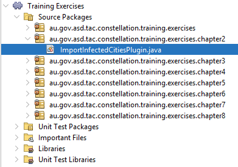

### 2.1.1: Create a plugin

To represent a plugin in Constellation, your class must either implement
the Plugin interface or extend one of the many plugin template classes.
In this case we are extending **RecordStoreQueryPlugin** as a convenient
way to create a plugin compliant with the Data Access View. Make your
class extend **RecordStoreQueryPlugin** and use the NetBeans hint
"Implement all abstract methods" to implement the required
**query(...)** method.

```java
public class ImportInfectedCitiesPlugin extends RecordStoreQueryPlugin {

    @Override
    protected RecordStore query(final RecordStore query, final PluginInteraction interaction, 
	        final PluginParameters parameters) throws InterruptedException, PluginException {
        ...
    }
}
```

### 2.1.2: Register your plugin

Constellation maintains a global registry of all plugins in the
application. To register your plugin, you need to include a
**\@ServiceProvider** annotation registering your class as implementing
the **Plugin** interface. Service providers are an inbuilt NetBeans
feature that allows classes to register themselves for lookup at
runtime. Constellation uses this framework extensively to provide most
of its extension mechanisms.

```java
@ServiceProvider(service = Plugin.class)
public class ImportInfectedCitiesPlugin extends RecordStoreQueryPlugin {
```

**TIP**: The **ServiceProvider** annotation registers a class as providing an
implementation of another class. Any registered classes can later be
looked up on request using the NetBeans Lookup API. In the case above,
the **ImportInfectedCitiesPlugin** class is being registered as a
**Plugin** so that the **PluginRegistry** class can locate it for later
use. Note that altering **ServiceProvider** annotations will require a
clean and build before changes will take effect.

As well as registering your plugin with Constellation, by convention
each plugin is also added as a static constant to a registry class in
the default package of its module. These registry classes are made
public and provide a convenient way for other developers to find your
plugin. Open the **PandemicPluginRegistry** class from the default
package of the exercise module and add:

```java
public static final String IMPORT_INFECTED_CITIES = ImportInfectedCitiesPlugin.class.getName();
```

We will discuss how these registry classes are used in Chapter 4 when we
need to instantiate and execute another plugin from our plugin.

### 2.1.3: Include your plugin in the Data Access View

Back in our plugin, there is an extra step required to include it in the
Data Access View. Your plugin should implement the **DataAccessPlugin**
interface (NetBeans will again help you implement the required methods)
and should include another **\@ServiceProvider** annotation registering
it as implementing the **DataAccessPlugin** interface

```java
@ServiceProviders({
    @ServiceProvider(service = DataAccessPlugin.class),
    @ServiceProvider(service = Plugin.class)
})

public class ImportInfectedCitiesPlugin extends RecordStoreQueryPlugin implements DataAccessPlugin {
```

### 2.1.4: Specify the type and position of your plugin in the Data Access
View:

Plugins displayed in the Data Access View are grouped into various
sections that all perform related tasks. You can specify which group
your plugin appears in by implementing the **getType()** method in your
plugin class. This is one of the methods NetBeans has inserted for you
as part of the **DataAccessPlugin** interface. Implement it as shown
below to specify you want your plugin to appear in the experimental
group. Note that the type needs to be a registered type name from an
implementation of **DataAccessPluginType**.

```java
@Override
public String getType() {
    return DataAccessPluginCoreType.EXPERIMENTAL;
}
```

Within a section, plugins are ordered based on their requested position.
You can specify this position by implementing another method from the
**DataAccessPlugin** interface:

```java
@Override
public int getPosition() {
    return 0;
}
```

Higher positions appear after lower positions. A position of 0 requests
your plugin to appear first in the section.

### 2.1.5: Give your plugin a name:

Each plugin in Constellation has a human readable name that is displayed
in the user interface. You can specify the name of your plugin by
overriding the **getName()** method from the **AbstractPlugin** class:

```java
@Override
public String getName() {
    return "Import Infected Cities";
}
```

However, Constellation provides a shortcut for this by specifying an
**\@NbBundle** message with a key identical to the class name. Delete
your implementation of **getName()** and replace it with an
**\@NbBundle** annotation on your class:

```java
@ServiceProviders({
    @ServiceProvider(service = DataAccessPlugin.class),
    @ServiceProvider(service = Plugin.class)
})

@NbBundle.Messages("ImportInfectedCitiesPlugin=Import Infected Cities")

public class ImportInfectedCitiesPlugin extends RecordStoreQueryPlugin implements DataAccessPlugin {
```

Finally, remove the **UnsupportedOperationException** from the body of
your query method and replace it with code to print out a message when
the plugin is run. At this stage we return an empty record store so
nothing will be added to the graph.

```java
@Override
protected RecordStore query(final RecordStore query, final PluginInteraction interaction, 
        final PluginParameters parameters) throws InterruptedException, PluginException {
    System.out.println("Testing Infected Cities Plugin");
    return new GraphRecordStore();
}
```

If you compile and run Constellation at this stage, you should see your
plugin appear in the Data Access View as expected:

1.  Your plugin should appear in the EXPERIMENTAL section of the data
    access view.

2.  Your plugin should appear at or near the top of the EXPERIMENTAL
    section based on your specified position of 0.

3.  Your plugin should be displayed with the name you specified in the
    **\@NbBundle** annotation.

Run your plugin on an empty graph to see your message appear in the
console.

### 2.1.6: Adding Graph Elements to the Graph

Adding nodes and transactions to the graph involves adding data to the
**RecordStore** instance returned from our query method. To begin with,
we will add a single node to the graph.

```java
@Override
protected RecordStore query(final RecordStore query, final PluginInteraction interaction, 
        final PluginParameters parameters) throws InterruptedException, PluginException {
    final RecordStore result = new GraphRecordStore();
    result.add();
    result.set(GraphRecordStoreUtilities.SOURCE + VisualConcept.VertexAttribute.IDENTIFIER, "Me");
    result.set(GraphRecordStoreUtilities.SOURCE + AnalyticConcept.VertexAttribute.TYPE, AnalyticConcept.VertexType.PERSON);

    return result;
}
```

If you compile and run Constellation again, your plugin will now add a
single node to the graph. You should see that Constellation has assisted
you by setting icon and colour values for the node based on the type you
specified.

{ width=40% }

Looking at the code, the query method performs three main tasks:

1.  Firstly, it creates a new **GraphRecordStore** object, an instance
    of **RecordStore** designed to interact with graphs. This data
    structure will hold the nodes and transactions that will be added to
    the graph.

2.  Next, **RecordStore.add()** is called to create a new row. Each row
    in a record store is capable of holding a transaction, as well as
    its source and destination nodes. However, if some elements are
    omitted, the remaining elements will still be added to the graph. We
    will make use of this behaviour by only specifying a source node.

3.  Finally, a series of **RecordStore.set(key,value)** calls are made
    to add column values to our new row. The **RecordStore** will
    automatically create new columns as they are needed and each key
    value adheres to a format that tells the **RecordStore** what type
    of element the column relates to. In this case, the column name
    begins with **GraphRecordStoreUtilities.***SOURCE* which indicates
    that this column belongs to the source node. Other prefixes that can
    be used are **GraphRecordStore.***DESTINATION* to specify a
    destination node attribute, or **GraphRecordStore.***TRANSACTION* to
    specify a transaction attribute. A transaction will only be created
    if both source and destination node attributes are specified
    explaining why, in this case, only a single node has been added to
    the graph. The remaining part of the key specifies the actual
    attribute that the column refers to in the graph, and for this we
    use well known attributes from the **VisualConcept** and
    **AnalyticConcept**. Schemas and concepts will be discussed further
    in Chapter 3.

As mentioned above, to add a transaction to the graph all that is needed
is to specify both source and destination node attributes (and
optionally transaction attributes) in a single row of the RecordStore:

```java
@Override
protected RecordStore query(final RecordStore query, final PluginInteraction interaction, 
        final PluginParameters parameters) throws InterruptedException, PluginException {
    final RecordStore result = new GraphRecordStore();
    result.add();
    result.set(GraphRecordStoreUtilities.SOURCE + VisualConcept.VertexAttribute.IDENTIFIER, "Me");
    result.set(GraphRecordStoreUtilities.SOURCE + AnalyticConcept.VertexAttribute.TYPE, AnalyticConcept.VertexType.PERSON);
	
    result.set(GraphRecordStoreUtilities.DESTINATION + VisualConcept.VertexAttribute.IDENTIFIER, "You");
    result.set(GraphRecordStoreUtilities.DESTINATION + AnalyticConcept.VertexAttribute.TYPE, 
	        AnalyticConcept.VertexType.PERSON);
	
    result.set(GraphRecordStoreUtilities.TRANSACTION + AnalyticConcept.TransactionAttribute.TYPE, 
	        AnalyticConcept.TransactionType.COMMUNICATION);

    return result;
}
```

Running Constellation again will now demonstrate that the plugin will
add a new transaction to the graph, as well as the source and
destination nodes for that transaction. Again, the schema has provided
assistance by setting an appropriate transaction colour based on the
specified transaction type.

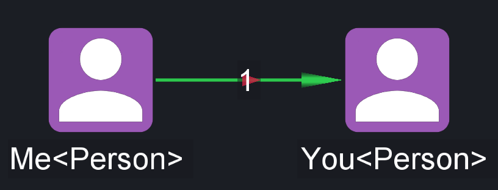

Finally, we will modify our query method to perform the task we
originally intended: to import all cities from our data set that have at
least one outbreak. To help us with this, and future data access tasks,
this training comes with a helper class, **OutbreakUtilities**, which
will perform the data access queries we required.

**TIP**: The **OutbreakUtilities** class has many useful methods that will be
used throughout this training document to simplify our development.

```java
@Override
protected RecordStore query(final RecordStore query, final PluginInteraction interaction, 
        final PluginParameters parameters) throws InterruptedException, PluginException {
    final RecordStore result = new GraphRecordStore();
    for (final OutbreakUtilities.City city : OutbreakUtilities.getInfectedCities()) {
        result.add();
        result.set(GraphRecordStoreUtilities.SOURCE + VisualConcept.VertexAttribute.IDENTIFIER, city.getName());
        result.set(GraphRecordStoreUtilities.SOURCE + AnalyticConcept.VertexAttribute.TYPE, 
		        AnalyticConcept.VertexType.LOCATION);
        result.set(GraphRecordStoreUtilities.SOURCE + "Population", city.getPopulation());
        result.set(GraphRecordStoreUtilities.SOURCE + SpatialConcept.VertexAttribute.LATITUDE, city.getLatitude());
        result.set(GraphRecordStoreUtilities.SOURCE + SpatialConcept.VertexAttribute.LONGITUDE, city.getLongitude());
        result.set(GraphRecordStoreUtilities.SOURCE + "Outbreak", city.getOutbreak());
    }
    return result;
}
```

Running your plugin now will import all infected cities into
Constellation, with a result similar to:


While the data is now successfully importing, one problem arises when
you attempt to histogram the city populations in order to find the
cities with the largest populations:


Notice that the populations are not sorting correctly as integers, but
rather as strings. This occurs because, unless directed otherwise, new
attributes created by a **RecordStore** are created as string
attributes. This can be corrected by appending a type to the end of a
column key ("\<" + type + "\>") when specifying **RecordStore** column
values:

```java
result.set(GraphRecordStoreUtilities.SOURCE + "Population" + "<" + IntegerAttributeDescription.ATTRIBUTE_NAME + ">", 
        city.getPopulation());
```

Running the plugin again will show that the population attribute now
sorts correctly as it has been added to the graph as an integer
attribute.

As the process of adding a city to a **RecordStore** is such a common
task, **OutbreakUtilities** provides another convenience method that
will do this for us. This allows us to simplify our query method:

```java
@Override
protected RecordStore query(final RecordStore query, final PluginInteraction interaction, 
        final PluginParameters parameters) throws InterruptedException, PluginException {
    final RecordStore result = new GraphRecordStore();
    for (final OutbreakUtilities.City city : OutbreakUtilities.getInfectedCities()) {
        result.add();
        OutbreakUtilities.addCityToRecord(city, result, GraphRecordStoreUtilities.SOURCE);
    }
    return result;
}
```

# Chapter 3: Schemas

One advantage to using a graph to represent data it can provide visual
cues to highlight features of the data. You may have noticed this when
you built your graph in the last exercise, with each node being given an
icon and a background colour automatically to help identify them as
representing people or locations. A Constellation graph is able to make
changes like these on its own by following a set of rules defined by a
developer; we call this set of rules a **schema**. Every graph in
Constellation will have a schema associated with it which defines the
**attributes** and **types** a graph considers important, as well as the
ways in which these attributes and types should interact with the graph.
Constellation is then able to use the rules in this schema to make
changes automatically in response to a user modifying a graph.

## Exercise 3.1: Pandemic Schema

We are now going to create our own schema to allow us more control over
how our pandemic data is represented in a Constellation graph. This will
help make analysis of the pandemic a bit easier later on. Start by
opening the **PandemicSchemaFactory** skeleton class from the 'chapter3'
package in the 'TrainingExercises' module.

### 3.1.1: Building a Schema Factory

To create a new schema, we first need a **SchemaFactory**, which is
responsible for creating **Schema** classes, and so it needs to define
several parameters used for schema construction. Ensure
**PandemicSchemaFactory** is registered as a **SchemaFactory** class,
and that it extends **AnalyticSchemaFactory**.

```java
@ServiceProvider(service = SchemaFactory.class)
public class PandemicSchemaFactory extends AnalyticSchemaFactory {
    ...
}
```

A schema should always be assigned a name. This name will be saved into
Constellation graph files so that the schema can be recalled on load,
and so it is important to remember that changing this name will break
any previously saved graphs which use this schema. Give
**PandemicSchemaFactory** a unique name.

```java
public static final String NAME = "au.gov.asd.tac.constellation.training.schema.PandemicSchemaFactory";

@Override
public String getName() {
    return NAME;
}
```

It is also required to give a schema a label and a description, whose
values will be displayed to the user within Constellation. Give
**PandemicSchemaFactory** a label and description.

```java
@Override
public String getLabel() {
    return "Pandemic Graph";
}

@Override
public String getDescription() {
    return "This graph provides support for analysing a pandemic - for training purposes";
}
```

The position of a schema will determine where it sits within the 'New
Graph' menu in Constellation. Lower positions are considered more
important by Constellation, and the schema with the lowest position will
become the default graph type. Give **PandemicSchemaFactory** a position
which will ensure it is the default schema factory.

```java
@ServiceProvider(service = SchemaFactory.class, position = 0)
public class PandemicSchemaFactory extends AnalyticSchemaFactory {
    ...
}
```

There are other attributes we could specify here, such as the key
attributes created schemas or the default labels for the graph, but for
this example we'll simply inherit the behaviour of the super class. Run
Constellation and observe that a 'Pandemic Graph' option exists in the
File menu under 'New Graph'. Currently creating a new graph with this
schema factory will cause an exception because we haven't defined the
schema itself yet. You may notice it inherits its icon from the Analytic
Schema; later on we will show you how to modify this.

### 3.1.2: Registering Schema Concepts

Now it's time to start defining what our schema is all about by
registering attributes and types to it. This is done by grouping
attributes and types into related concepts using the **SchemaConcept**
class, and registering these concepts to our schema. Let's start by
registering some existing schema concepts to **PandemicSchemaFactory**.

-   **The Constellation Views Concept**: defines attributes used by
    views in Constellation; this should be registered to all schemas.

-   **The Visual Concept**: allows our schema awareness of colours,
    icons and other visual attributes

-   **The Analytic Concept**: enables us to effectively analyse our data
    as a graph by providing knowledge of types and other relevant
    attributes.

```java
@Override
public Set<Class<? extends SchemaConcept>> getRegisteredConcepts() {
    final Set<Class<? extends SchemaConcept>> registeredConcepts = new HashSet<>();
    registeredConcepts.add(ConstellationViewsConcept.class);
    registeredConcepts.add(VisualConcept.class);
    registeredConcepts.add(AnalyticConcept.class);
    return Collections.unmodifiableSet(registeredConcepts);
}
```

### 3.1.3: Building a Schema

There's just one thing left to do now; we need to define the schema this
factory will create, which is done using the **Schema** class. Try
creating a pandemic schema class (which should extend as
**AnalyticSchema**) as an inner class within **PandemicSchemaFactory**.

```java
protected class PandemicSchema extends AnalyticSchema {
    public PandemicSchema(final SchemaFactory factory) {
        super(factory);
    }
}
```

To complete this step, you must also tell the schema factory that the
pandemic schema is the schema it should be building.

```java
@Override
public Schema createSchema() {
    return new PandemicSchema(this);
}
```

Try running Constellation and creating a Pandemic Graph. This graph
should successfully open.

A schema gives us the opportunity to perform smart operations at certain
points within the lifecycle of a graph. For example, we can fully
specify the behaviour of the graph when it is opened, or when a node is
added to it. Try implementing the **completeVertex** method in the
**PandemicSchema** class to update the type of 'Location' vertices to
'City' vertices. You can test this behaviour out by launching
CONSTELLATION and running the 'Import Infected Cities' plugin from the
previous chapter.

```java
@Override
public void completeVertex(final GraphWriteMethods graph, final int vertex) {
    final int typeAttributeId = AnalyticConcept.VertexAttribute.TYPE.get(graph);
    final SchemaVertexType vertexType = graph.getObjectValue(typeAttributeId, vertex);
    if (AnalyticConcept.VertexType.LOCATION.equals(vertexType)) {
        graph.setStringValue(typeAttributeId, vertex, "City");
    }
    super.completeVertex(graph, vertex);
}
```

**Schema Attributes**

Every feature in Constellation relies on attributes. Fundamentally you
need attributes to store and categorise data within a graph, but they
are also required for almost all of Constellation's views and plugins to
operate. We saw how easy it is to create new attributes using a record
store in the previous chapter, but attributes created this way cannot
easily be used for functionality outside of the plugin in which they are
created. Registering **schema attributes** to your schema ensures that
will always be available to any graph using your schema. This also
provides you the opportunity to customise the attribute, including
specifying a name and description for the attribute and whether or not
to add it to the graph up front. Schema attributes will be coloured grey
within the Attribute Editor.

## Exercise 3.2: Outbreak Attribute, Part 1

Since the focus of our scenario is on tracking the spread of various
diseases, it would be beneficial for us to allow full control over the
way we manage data related to these diseases. To achieve this we will
build an 'Outbreak' attribute and register it to our schema.

### 3.2.1: Building a Schema Concept

A schema attribute should always be associated with a schema concept, so
let's build a 'pandemic concept'. This concept will need to be
registered as a **SchemaConcept** class, and given a name as well as a
set of parent concepts. It is worth noting that when we register a
concept to a schema, all of its children will also be registered. Open
and complete the **PandemicConcept** class now, assigning
**AnalyticConcept** as its parent.

```java
@ServiceProvider(service = SchemaConcept.class)
public class PandemicConcept extends SchemaConcept {
    @Override
    public String getName() {
        return "Pandemic";
    }

    @Override
    public Set<Class<? extends SchemaConcept>> getParents() {
        final Set<Class<? extends SchemaConcept>> parentSet = new HashSet<>();
        parentSet.add(AnalyticConcept.class);
        return Collections.unmodifiableSet(parentSet);
    }
}
```

### 3.2.2: Building a Schema Attribute

Schema attributes can be built using the builder pattern available to
the **SchemaAttribute** class, making it easy to see what aspects of an
attribute can be modified. Note that once a schema attribute has been
built it is immutable. Build an outbreak schema attribute in the
**PandemicConcept** class, setting its type to 'string' for now. Note
that we have placed our schema attribute within the static inner class
**VertexAttribute**. This is not required but is a convenient way to
group attributes and types for ease of use later.

```java
public static class VertexAttribute {
    ...
    public static final SchemaAttribute OUTBREAK = new SchemaAttribute.Builder(GraphElementType.VERTEX, 
	        StringAttributeDescription.ATTRIBUTE_NAME, "Outbreak")
        .setDescription("An outbreak consisting of one or more diseases and their influence")
        .create()
        .build();
}
```

You also need to build a population schema attribute. Take some
time to look over the properties which can be set using the schema
attribute builder.

### 3.2.3: Registering Schema Attributes

Once you have one or more schema attributes, you should register them
with your concept by overriding the **getSchemaAttributes** method.
Register your outbreak schema attribute to the **PandemicConcept**
class.

```java
@Override
public Collection<SchemaAttribute> getSchemaAttributes() {
    final List<SchemaAttribute> schemaAttributes = new ArrayList<>();
    ...
    schemaAttributes.add(VertexAttribute.OUTBREAK);
    return Collections.unmodifiableCollection(schemaAttributes);
}
```

Once your concept is complete, don't forget that you will need to
register it to a schema before you will be able to make use of it within
Constellation. In this example, since we set the parent concept of our
pandemic concept to the analytic concept, and have registered the
analytic concept with our pandemic schema, the pandemic concept will be
included automatically. Observe your new attribute in action by
launching Constellation and observing your new attribute in the
Attribute Editor.

## Exercise 3.3: Outbreak Attribute, Part 2

It is often useful to store more complex Java objects on the graph,
allowing more specialised functionality. Since our outbreak attribute is
holding information about a set of diseases and the population affected
by each, it would make more sense to store this data in a Map, and to
provide helpful methods for manipulating the data. For this exercise we
will be making use of the 'Outbreak' class we have provided.

### 3.3.1: Defining a New Attribute Type

In order to use the 'Outbreak' object as a Constellation attribute, we
need to describe how it fits into the attribute framework; this is done
using the **AttributeDescription** class. An attribute description
defines how this object should be written to and retrieved from memory.
Since our attribute will be managing an object (as opposed to a
primitive type), we can make use of the simplified
**AbstractObjectAttributeDescription** class, which severely decreases
the number of operations we have to define. Open and examine the
**OutbreakAttributeDescription** class.

```java
@ServiceProvider(service = AttributeDescription.class)
public class OutbreakAttributeDescription extends AbstractObjectAttributeDescription {
    public static final String ATTRIBUTE_NAME = "outbreak";
    public static final Class<?> NATIVE_CLASS = Outbreak.class;
    public static final Outbreak DEFAULT_VALUE = null;
    public OutbreakAttributeDescription() {
        super(ATTRIBUTE_NAME, NATIVE_CLASS, DEFAULT_VALUE);
    }
}
```

An attribute description will typically store and manage an array of
attribute values where each index within the array will represent an
element on the graph with the equivalent id. For our
**OutbreakAttributeDescription** class, this will be an array of
**Outbreak** objects which is actually defined in the super class as
**data\[\]**. While we still have the option to override any of the
methods for managing this array defined by an attribute description, the
only functionality we are required to define using this simplified
sub-class is how to store and retrieve this object as a string value.
The **Outbreak** class contains **toString** and **valueOf** methods for
converting to and from a string, so have a go at using these to complete
the attribute description.

```java
@Override
public void setString(final int id, final String value) {
    data[id] = Outbreak.valueOf(value);
}

@Override
public String getString(final int id) {
    return data[id] == null ? null : data[id].toString();
}
```

Now we should go back to the **PandemicConcept** class and redefine the
existing outbreak schema attribute as an outbreak type attribute instead
of a string type attribute.

```java
public static class VertexAttribute {
    ...
    public static final SchemaAttribute OUTBREAK = new SchemaAttribute.Builder(GraphElementType.VERTEX, 
	        OutbreakAttributeDescription.ATTRIBUTE_NAME, "Outbreak")
        .setDescription("An outbreak consisting of one or more diseases and their influence")
        .create()
        .build();
}
```

Now if you run Constellation, right click on your Outbreak attribute in
the Attribute Editor and choose *Modify Attribute*, you should see its
type set as "outbreak". You might also notice that you cannot edit this
attribute; we'll address this later.

### 3.3.2: Defining Attribute IO

Since this is a brand new attribute type, we will also need to define
how to save and load any data of this type to disk; this is done using
the **AbstractGraphIOProvider** class. Before we do this, try opening
and saving a Pandemic Graph in Constellation, and observing how the
outbreak information is lost. Now open and complete the
**OutbreakIOProvider** class.

```java
@ServiceProvider(service = AbstractGraphIOProvider.class)
public class OutbreakIOProvider extends AbstractGraphIOProvider {

    @Override
    public String getName() {
        return OutbreakAttributeDescription.ATTRIBUTE_NAME;
    }
}
```

Constellation .star files store the graph as compressed JSON, so our IO
provider should define how to write 'Outbreak' attributes in the JSON
format, and how to read the resulting JSON data back into an 'Outbreak'
attribute type.

```java
@Override
public void readObject(final int attributeId, final int elementId, final JsonNode jnode, final GraphWriteMethods graph, 
        final Map<Integer, Integer> vertexMap, final Map<Integer, Integer> transactionMap, 
		final GraphByteReader byteReader, final ImmutableObjectCache cache) throws IOException {
    final String attributeValue = jnode.isNull() ? null : jnode.textValue();
    graph.setStringValue(attributeId, elementId, attributeValue);
}

@Override
public void writeObject(final Attribute attribute, final int elementId, final JsonGenerator jsonGenerator, 
        final GraphReadMethods graph, final GraphByteWriter byteWriter, final boolean verbose) throws IOException {
    if (verbose || !graph.isDefaultValue(attribute.getId(), elementId)) {
        final String attributeValue = graph.getStringValue(attribute.getId(), elementId);
        if (attributeValue == null) {
            jsonGenerator.writeNullField(attribute.getName());
        } else {
            jsonGenerator.writeStringField(attribute.getName(), attributeValue);
        }
    }
}
```

Try opening and saving a Pandemic Graph in Constellation again and
observe that it no longer fails.

**Schema Types**

The final function we want our schema to assist users with is
understanding the types of data that the schema deals with. Similar to
attributes, types can be used in special ways by views or plugins within
Constellation, so it is a good idea to register them to a schema if we
want this ability.

## Exercise 3.4: City and Flight Types

For our scenario, we have decided that the best way to visualise the
spread of disease is to connect cities by the flights connecting them.
This means we should create a 'city 'node type and a 'flight'
transaction type and register these types to our schema. This is where
**schema types** come into play.

### 3.4.1: Building a Schema Type

A vertex type can be created using a builder on the **SchemaVertexType**
class, making it easy to see what aspects of a vertex type can be
modified. Note that once a type has been built, it is immutable. Let's
go ahead and build a 'city' vertex type for **PandemicConcept**.

```java
public static class VertexType {
    public static final SchemaVertexType CITY = new SchemaVertexType.Builder("City")
        .setDescription("A node representing a city, eg. Canberra, Australia.")
        .setColor(ConstellationColor.CLOUDS)
        .setForegroundIcon(AnalyticIconProvider.GLOBE)
        .setBackgroundIcon(IconManager.getIcon("Flat Square"))
        .build();
}
```

Creating a transaction type involves a very similar process. Let's go
ahead and build a 'flight' transaction type for **PandemicConcept**.

```java
public static class TransactionType {
    public static final SchemaTransactionType FLIGHT = new SchemaTransactionType.Builder("Flight")
        .setDescription("A flight route connecting two locations.")
        .setColor(ConstellationColor.BANANA)
        .build();
}
```

Take some time to look over the properties which can be set using the
vertex type and transaction type builders.

### 3.4.2: Registering Schema Types

In order for our schema to make use of these types, we will need to
register them to **PandemicConcept**.

```java
@Override
public List<SchemaVertexType> getSchemaVertexTypes() {
    final List<SchemaVertexType> schemaVertexTypes = new ArrayList<>();
    schemaVertexTypes.add(VertexType.CITY);
    return Collections.unmodifiableList(schemaVertexTypes);
}

@Override
public List<SchemaTransactionType> getSchemaTransactionTypes() {
    final List<SchemaTransactionType> schemaTransactionTypes = new ArrayList<>();
    schemaTransactionTypes.add(TransactionType.FLIGHT);
    return Collections.unmodifiableList(schemaTransactionTypes);
}
```

Now if you run Constellation and run the 'Import Infected Cities' plugin
again, your City nodes should have the icons and colour we specified.

## Exercise 3.5: Biohazard Icon

It's likely that if you go to the effort of creating your own schema,
you will also want some icons to differentiate it from the others.
Adding built-in icons to Constellation is just as simple as adding
attributes or types, so let's try adding an icon now.

### 3.5.1: Building an Icon Provider

Before we build an icon, we should create an **IconProvider**. Open
**PandemicIconProvider**; it should look something like this:

```java
@ServiceProvider(service = ConstellationIconProvider.class)
public class PandemicIconProvider implements IconProvider {
    ...
}
```

### 3.5.2: Building a Constellation Icon

Now we can add an icon to this icon provider using the builder on the
**ConstellationIcon** class. This builder will require you to define the
icon using an implementation of the **IconData** class. In this example
we will use the **FileIconData** to load a PNG file from the codebase,
but it is worth noting that several other **IconData** implementations
exist for loading icons in different ways.

```java
public static final ConstellationIcon BIOHAZARD = new ConstellationIcon.Builder("Biohazard", 
        new FileIconData("modules/ext/biohazard.png", "au.gov.asd.tac.Constellation.training"))
    .addCategory("Training")
    .build();

@Override
public List<ConstellationIcon> getIcons() {
    final List<ConstellationIcon> pandemicIcons = new ArrayList<>();
    pandemicIcons.add(BIOHAZARD);
    return Collections.unmodifiableList(pandemicIcons);
}
```

**TIP**: The **FileIconData** class makes use of NetBeans
**InstalledFileLocator** service internally. This allows you to safely
look-up a file resource with reference to a module, which can be
extremely useful as NetBeans will often move files during a build.

### 3.5.3: Setting an Icon

Finally, we should set this icon wherever we wish to use it; in this
case we will use it to represent our pandemic schema. Override the
**getIconSymbol** method on **PandemiSchemaFactory** to achieve this.

```java
@Override
public ConstellationIcon getIconSymbol() {
    return PandemicIconProvider.BIOHAZARD;
}
```

Try creating a new icon yourselves and adding it to the 'City' schema
type. This will involve building a new **ConstellationIcon**, and
setting it as the icon for the 'City' vertex type you created earlier.

Now that we have our own schema designed around the pandemic scenario,
try running the 'Import Infected Cities' plugin again and observe the
results.

# Chapter 4: Advanced Data Access

In Chapter 2, we implemented a fully functional Data Access Plugin that
imported all the cities that are currently experiencing an outbreak.
However, there are several additional aspects of a plugin's execution
that we left out:

1.  **Plugin parameters:** in most cases, a plugin will require
    configuration from the user before it executes, such as time ranges.
    Plugin parameters provide a simple way for plugins to request common
    configuration values from the user such as strings, numbers, times
    and dates, with various entry methods such as text boxes and choice
    boxes.

2.  **Plugin interaction:** during its execution, a plugin has the
    option to interact with the user, either by providing feedback or
    requesting additional input.

3.  **Error handling:** if something goes wrong while a plugin is
    running, Constellation provides simple mechanisms to alert the user,
    and modifications made by the plugin as it is rolled-back.

4.  **Interruption:** Constellation provides a consistent mechanism that
    allows the user to cancel a plugin's execution and roll-back any
    changes the plugin has made.

5.  **Plugin Registry:** Constellation's global registry of all plugins
    in the application that enables a plugin to find and execute other
    plugins during its execution.

6.  **Logging:** Constellation provides inbuilt logging that records the
    execution of each plugin, including start/stop times and any
    parameters that have been passed to the plugin. The logging
    framework can be extended to send the logging events to custom
    destinations. This will be further explored in Chapter 8.

In this chapter, we will implement two new plugins that will make use of
each of these features. The first will use plugin parameters to allow
the user to import a custom list of cities while the second will allow
the user to find flights connecting the selected cities on their graph,
adding the new flights and connecting cities to their graph.

## Exercise 4.1: Import Custom Cities Plugin

The Import Custom Cities Plugin will behave similarly to the Import
Infected Cities we developed in Chapter 2, except that it will allow the
user to choose which cities to import. To do this, we will add a
parameter to our plugin providing a text box in which the user can enter
the cities they are interested in, one on each line. To ease
development, we will begin with a skeleton class in the chapter4 package
of the Training Exercises module. Within this package, locate and open
the **ImportCustomCitiesPlugin** class, noting that many of the steps
you performed in Chapter 2 have been already included. Add this plugin
to the **PandemicPluginRegistry** following the same method as shown in
Chapter 2 for the **ImportInfectedCitiesPlugin**. Note that the service
provider annotations have been commented out to prevent the plugin from
being loaded in Constellation before now. These should be uncommented.

### 4.1.1: Adding a Parameter

To add parameters to a plugin, you will need to implement the
**createParameters()** method on your **Plugin** class. Do this now,
adding the following code to your class:

```java
private static final String CITIES_PARAMETER_ID = PluginParameter.buildId(ImportCustomCitiesPlugin.class, "cities");

@Override
public PluginParameters createParameters() {
    final PluginParameters parameters = new PluginParameters();
	
    final PluginParameter<StringParameterValue> citiesParameter = StringParameterType.build(CITIES_PARAMETER_ID);
    citiesParameter.setName("Cities");
    citiesParameter.setDescription("Enter the names of cities to import, one per line");
    StringParameterType.setLines(citiesParameter, 10);
    parameters.addParameter(citiesParameter);
	
    return parameters;
}
```

This method adds a single string parameter to our plugin, specifying
that the value should be edited in a text box with 10 lines. We also
specify a label and brief description that will be displayed to the
user. Notice that some configuration of plugin parameters is not
performed on the parameter itself, but rather through static methods on
the **PluginParameterType**. Note also that each parameter is created
with an ID value that should be unique within the application and will
be used later to get the parameter when the plugin is running. By
convention, we ensure uniqueness by prefixing the ID with the class
name. There are many other parameter types such as
**BooleanParameterType**, **IntegerParameterType** and
**DateTimeRangeParameterType**. Consult the Constellation Javadoc on
usage of these types.

If you compile and run Constellation now, you will see the Import Custom
Cities plugin alongside the Import Infected Cities plugin in the Data
Access View. Expanding the plugin's parameter pane will reveal our
cities parameter which can be filled in:


You can now enter in city names but running the plugin will cause no
effect because we have not modified our query method to use the values
entered into our new parameter.

### 4.1.2: Modify the query method to use the user entered city names

```java
@Override
protected RecordStore query(final RecordStore query, final PluginInteraction interaction, 
        final PluginParameters parameters) throws InterruptedException, PluginException {
    final RecordStore result = new GraphRecordStore();

    final String citiesString = parameters.getStringValue(CITIES_PARAMETER_ID);
    final String[] cityNames = citiesString.split("\n", -1);

    for (final String cityName : cityNames) {
        final OutbreakUtilities.City city = OutbreakUtilities.getCity(cityName);
        result.add();
        OutbreakUtilities.addCityToRecord(city, result, GraphRecordStoreUtilities.SOURCE);
    }
    return result;
}
```

The query method now retrieves the user entered string from its
parameter using the parameter ID as a key, splits the string on newline
characters to get the individual city names and uses another access
helper method to get the attributes for that city. The remaining code is
similar to the previous plugin.

Compile and run Constellation to demonstrate that the plugin now adds
the correct city nodes to the graph based on the user input.

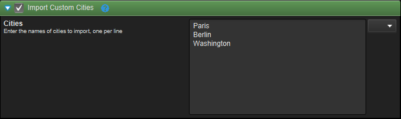


### 4.1.3: Handling Errors

What happens if the user enters a city name that is not in our dataset?
We have implemented the helper function to return null which will cause
a **NullPointerException** to be thrown. Luckily, Constellation will
handle exceptions thrown from a plugin by rolling back any changes the
plugin has made and presenting the exception stack trace in a dialog:

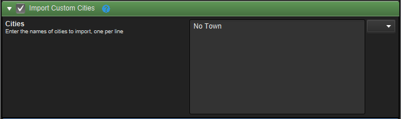


While this works and will protect the data integrity of the graph,
Constellation provides a more elegant way of handling errors by using
the **PluginException** class. Add a null check to your query method:

```java
for (final String cityName : cityNames) {
    final OutbreakUtilities.City city = OutbreakUtilities.getCity(cityName);
    if (city == null) {
        throw new PluginException(PluginNotificationLevel.WARNING, "Unknown City: " + cityName);
    }
    ...
}
```

Throwing a **PluginException** from your plugin allows you to customise
the way in which Constellation responds to the error. Depending on the
**PluginNotificationLevel** specified, Constellation will respond in
different ways:

1.  *FATAL*, *ERROR*: A dialog box is displayed describing the error

2.  *WARNING*: A notification bubble is displayed describing the error

3.  *INFO*: A status message in displayed describing the error

4.  *DEBUG*: The user is not informed and a line is sent to the default
    log.

Attempting to add a missing city will now display a notification in the
bottom right corner of the Constellation window. Try setting different
notification levels and see what effect that has on the user experience.

## 4.2: Chain Cities Plugin

The second plugin we will implement in this chapter is the
**ChainCitiesPlugin** which will find all flights into or out of the
selected cities in your graph and add them as new transactions, along
with their source and destination cities, if they do not already exist
in the graph. Again, we will begin with a skeleton class that already
implements the basics to give ourselves a head start. Open the
**ChainCitiesPlugin** class in the Chapter 4 package of the Training
Exercises to begin. As always, remember to add this plugin to the
**PandemicPluginRegistry** and uncomment the service provider
annotations.

During the read stage, a **RecordStoreQueryPlugin** collects relevant
selected graph elements from the graph and adds them to a
**RecordStore**, along with all known attributes for each element. This
**RecordStore** is passed to the query method through the query
**RecordStore** in its parameters. By default, all selected nodes are
included but other options can be specified by overriding the
**getRecordStoreType()** method. For instance, all selected transactions
could be returned by:

```java
@Override
public String getRecordStoreType() {
    return GraphRecordStoreUtilities.TRANSACTION;
}
```

We will not override this method as we need the default behaviour.

### 4.2.1: Read the query RecordStore

Our plugin will get the currently selected nodes from the graph by using
the default behaviour of the **RecordStoreQueryPlugin** and reading the
rows of the query **RecordStore.** To begin with, modify our query
method to print the name of each city to the console.

```java
@Override
protected RecordStore query(final RecordStore query, final PluginInteraction interaction, 
        final PluginParameters parameters) throws InterruptedException, PluginException {
    final RecordStore result = new GraphRecordStore();
    query.reset();
    while (query.next()) {
        final String cityName = query.get(GraphRecordStoreUtilities.SOURCE + VisualConcept.VertexAttribute.IDENTIFIER);
        System.out.println(cityName);
    }
    return result;
}
```

A **RecordStore** has an inbuilt row pointer that makes accessing its
rows in order more convenient, so the first thing the new query method
does is reset the pointer to just before the first record. This allows
an elegant iteration over all the records as shown. At each row, the
identifier attribute is read and printed to standard out. If you build
and run Constellation at this point, the plugin will print all selected
city names to the console.

### 4.2.2: Adding Flights

The next step is to perform a query for each selected city and add the
resulting flights to the graph:

```java
@Override
protected RecordStore query(final RecordStore query, final PluginInteraction interaction, 
        final PluginParameters parameters) throws InterruptedException, PluginException {
    final RecordStore result = new GraphRecordStore();
    query.reset();

    while (query.next()) {
        final String cityName = query.get(GraphRecordStoreUtilities.SOURCE + VisualConcept.VertexAttribute.IDENTIFIER);
        for (final OutbreakUtilities.Flight flight : OutbreakUtilities.getFlights(cityName)) {
            final City source = flight.getSource();
            final City destination = flight.getDestination();
            result.add();

            OutbreakUtilities.addCityToRecord(source, result, GraphRecordStoreUtilities.SOURCE);
            result.set(GraphRecordStoreUtilities.TRANSACTION + TemporalConcept.TransactionAttribute.DATETIME, 
			        flight.getDepartureTime());
            OutbreakUtilities.addCityToRecord(destination, result, GraphRecordStoreUtilities.DESTINATION);
        }
    }
    return result;
}
```

By now you should find the new code familiar as it follows the same
pattern we used in Chapter 2 to add transactions to the graph. As each
city is read from the query **RecordStore**, we use another convenience
method in the **OutbreakUtilities** class to find all flights leaving or
departing that city. With that information, we add a new row to the
result **RecordStore**, including the departing city as the source node,
the destination city as the destination node, and the flight itself as
the transaction between them. Notice how we did not need to de-duplicate
the city nodes as Constellation will do this for us based on the
schema's attribute keys.

As with cities, adding flights to a **RecordStore** is such a common
occurrence that **OutbreakUtilities** provides a convenience method for
this also:

```java
...
for (final OutbreakUtilities.Flight flight : OutbreakUtilities.getFlights(cityName)) {
    result.add();
    OutbreakUtilities.addFlightToRecord(flight, result);
}
...
```

Note: The above code replaces the **entire** for loop from previous code snippet.

### 4.2.3: Add Plugin Interaction

Constellation provides mechanisms by which the plugin can provide
real-time progress and feedback to the user as it executes. In this
section, we will use these mechanisms to provide a simple progress bar
display along with a status message that will update as each city is
processed.

```java
Modify your ChainCitiesPlugin.query() method:
...

final RecordStore result = new GraphRecordStore();
int currentStep = 0;
query.reset();

while (query.next()) {
    final String cityName = query.get(GraphRecordStoreUtilities.SOURCE + VisualConcept.VertexAttribute.IDENTIFIER);
    interaction.setProgress(currentStep++, query.size(), "Processing: " + cityName, true);
...
```

As we process each city, we call **setProgress(...)** on the provided
**PluginInteraction** object. This allows us to both pass a progress
value in the form of current step and total steps, as well as a simple
status message.

**TIP**: Constellation provides an inbuilt mechanism that will interrupt the
execution of a plugin and revert any changes that plugin has made to the
graph. A plugin can request that this happens by throwing an
**InterruptedException** at any time in its execution. In addition,
Constellation can request a plugin cancels its execution by setting the
interrupt flag on its thread. It is the responsibility of the plugin to
periodically check this flag, especially during long-running tasks, and
throw an **InterruptedException** if it finds that this flag is set. As
it is also good practice to provide progress updates to the user during
these long running tasks, the **setProgress(...)** method will check the
interrupt flag and throw the required exception for you, preventing the
need to check the flag manually. This means, that by regularly updating
the plugins progress as shown above, the plugin is automatically
cancellable. This check is enabled by specifying true as the last
parameter to **setProgress(...)**.

Build and run Constellation and observe the progress bar and status
message in the bottom left corner as the plugin runs.

### 4.2.4: Datetime Range Parameters

Many data access plugins limit their queries to user defined time ranges
and the **ChainCitiesPlugin** should be no exception. To do this, we
need to add a datetime range parameter to our plugin by implementing the
**createParameters()** method, similar to our
**ImportCustomCitiesPlugin**:

```java
@Override
public PluginParameters createParameters() {
    final PluginParameters parameters = new PluginParameters();

    final PluginParameter<DateTimeRangeParameterType.DateTimeRangeParameterValue> datetime 
	        = CoreGlobalParameters.DATETIME_RANGE_PARAMETER;
    parameters.addParameter(datetime);
    return parameters;
}
```

A significant difference this time is that we have used a globally
defined parameter (with its own globally defined parameter ID), instead 
of creating our own as we did in the **ImportCustomCitiesPlugin**. 
Previously, we wanted to make our parameter ID unique so that it did not 
clash with other parameters in the application. In this case, we want to 
match the parameter ID of other data access plugins that specify a 
datetime range parameter. This will allow the Data Access View to 
present this parameter only once instead of making the users enter in 
the same values multiple times.

Run Constellation now and see that the datetime range parameter has not
appeared under our plugin's heading. However, our plugin will have
access to the parameter displayed at the top of the Data Access View.

There is nothing wrong with specifying a unique ID for your own datetime
range parameters. This will cause your plugin to create its own
parameter in the user interface and will allow your users to specify a
datetime range independently of the main value. However, in most cases,
the behaviour we have created here is preferred.

Finally, we need to make use of the datetime range in our query method.
For this we use another **OutbreakUtilities** helper method that accepts
a start and end time and only returns flights where the departure time
falls within this range. Add the following to the top of our existing
query method:

```java
final DateTimeRange datetimeRange = parameters.getDateTimeRangeValue(CoreGlobalParameters.DATETIME_RANGE_PARAMETER_ID);
final long startTime = datetimeRange.getZonedStartEnd()[0].toInstant().toEpochMilli();
final long endTime = datetimeRange.getZonedStartEnd()[1].toInstant().toEpochMilli();

Now adjust our call to getFlights(...) to use the version that that
takes a time range:

for (final OutbreakUtilities.Flight flight : OutbreakUtilities.getFlights(cityName, startTime, endTime)) {
```

Running your plugin now will show that the datetime range entered in the
global Data Access View parameters will be used to filter the flights
that are returned.

### 4.2.5: Plugin Registry

Constellation keeps a registry of every plugin available in the
application. By querying the registry, you can find out which plugins
are available and access various properties of each plugin including its
name, description and the parameters it requires. You are also able to
create an instance of a plugin and run it. In the current iteration of
our **ChainCitiesPlugin**, we add new nodes and transaction to the graph
with no attention to the layout of our expanded graph. In this section,
we will make use of the plugin registry to run a layout algorithm on the
newly added content.

While it may be tempting to simply add code to the end of our query
method that will cause an arrangement to occur, recall that the query
method is only responsible for adding the new content to a
**RecordStore** and not for actually adding that content to the graph.
This process is handled by the **RecordStoreQueryPlugin** parent class
and does not occur until the edit method is run. If the arrangement was
to occur in the query method, the new content would not be included.

**RecordStoreQueryPlugin** implements the **edit(...)** method from
**SimpleQueryPlugin** in order to add content to the graph. This means
that we can also add functionality at this time by doing the same:

```java
@Override
protected void edit(final GraphWriteMethods wg, final PluginInteraction interaction, 
        final PluginParameters parameters) throws InterruptedException, PluginException {
    super.edit(wg, interaction, parameters);

    final Plugin deselectAllPlugin = PluginRegistry.get(VisualGraphPluginRegistry.DESELECT_ALL);
    final Plugin treesPlugin = PluginRegistry.get(ArrangementPluginRegistry.TREES);
    final Plugin resetPlugin = PluginRegistry.get(InteractiveGraphPluginRegistry.RESET_VIEW);

    PluginExecution.withPlugin(deselectAllPlugin).executeNow(wg);
    PluginExecution.withPlugin(treesPlugin).executeNow(wg);
    PluginExecution.withPlugin(resetPlugin).executeNow(wg);
}
```

The new implementation of **edit(...)** performs 3 tasks:

1.  Firstly, it calls its parent's implementation which will cause the
    new content to be added to the graph.

2.  Secondly, it queries the **PluginRegistry** for the tree arrangement
    plugin. By convention, each module that contributes plugins to
    Constellation provides a registry class that contains static plugin
    names for each plugin they provide. Look at the documentation for
    **ArrangementRegistry** to see how this is done. By including a
    **\@ServiceProvider** annotation on your plugin class, your plugin
    is also included in the registry and can be run by other plugins.

3.  Finally, the plugin is run on the current thread, using the write
    lock that has already been granted to our plugin. There are several
    modes in which a plugin can be run, including those that run the
    plugin on the current thread (**executeNow(...)**) or on another
    thread (**executeLater(...)**). There are also options that allow
    you to pass through an existing graph lock, or allow the called
    plugin to gain its own lock. These options will be explored in more
    detail in Chapter 6.

In situations like this, where a plugin is to be called with no options,
**PluginExecution** provides a more convenient syntax that looks up the
plugin and executes it in one line:

```java
PluginExecution.withPlugin(ArrangementPluginRegistry.TREES).executeNow(wg);
```

# Chapter 5: Analytic Plugins

In the previous chapter we explored some of the extra features of data
access plugins, that are concerned with reading data from and writing to
the graph using a **RecordStore**. This pattern works well for data
access plugins, but to perform analytics on your data it is a bit
limiting. In this chapter we will look at using the graph API directly,
examine some different plugin templates, study methods of executing
plugins within plugins, and write a NetBeans **Action** that allows a
plugin to be run from Constellation's menu (rather than the data access
view).

**TIP**: For the remainder of this tutorial, when testing plugins and other
extensions, it is recommended to use the graph we produced by running
Import Custom cities, followed by Chain Cities. Please run these plugins
and save the graph.

**The Graph API**

Until now we have been reading from and writing to the graph indirectly.
Constellation also has a rich API to interact directly with the graph.
The API makes a clear distinction between reading and writing for the
purposes of locking and integrity of the graph

Two interfaces, **GraphReadMethods** and **GraphWriteMethods**, provide
all the standard operations for interacting with a graph.
**GraphWriteMethods** extends **GraphReadMethods** so that anything you
can do while reading, you can also do while writing. Objects
implementing these interfaces are given to you in the
**SimpleReadPlugin** and **SimpleEditPlugin**, respectively.

Graph elements are stored on the graph using an integer ID. This ID is
constant and unique to that graph and element type, so long as the
element remains on the graph. No guarantees can be made about the ID of
a vertex that was removed (whether or not it will be reused or by which
vertex).

To iterate through all the IDs of vertices on the graph, for example, we
could use the following loop (assuming we have a **GraphReadMethods** or
**GraphWriteMethods** called graph):

```java
for (int vertexPosition = 0; vertexPosition < graph.getVertexCount(); vertexPosition++) {
    final int vertexId = graph.getVertex(vertexPosition);
}
```

This example is for vertices but similar code works for other graph
elements. Graph element IDs are used by the rest of the API, so with
these IDs we could now answer a question such as 'what is the highest
degree (number of neighbours) of a vertex in the graph?'

```java
int maxDegree = 0;
for (int vertexPosition = 0; vertexPosition < graph.getVertexCount(); vertexPosition++) {
    final int vertexId = graph.getVertex(vertexPosition);
    final int degree = graph.getVertexNeighbourCount(vertexId);

    if (degree > maxDegree) {
        maxDegree = degree;
    }
}
```

In the above code, maxDegree will hold the maximum degree at the end of
the loop. The method **getVertexNeighbourCount()** is answering a
question about the graph structure. We could also use vertexId to
perform an attribute based operation, such as setting the vertex's
population, but for this we also need the ID of the population attribute
on the graph. We can get this from the attribute itself in the relevant
**SchemaConcept**.

```java
final int populationAttributeId = PandemicConcept.VertexAttribute.POPULATION.get(graph);
final int population = graph.getIntValue(populationAttributeId, vertexId); 
graph.setIntValue(populationAttributeId, vertexId, population + 1000);
```

The above code sets the value of the population attribute for the node
with ID vertexId to 1000 more than its previous value. Note that we use
**getIntValue()** and **setIntValue()** because we know that population
is an integer attribute. There are analogous operations for getting and
setting other primitive values, and strings. When none of these apply,
**setObjectValue()** and **getObjectValue()** should be used.

There is a lot more to the graph API, but that covers the basics. We
will continue to use it as we write plugins in this chapter, but you
should refer to the JavaDoc should you wish to know more. When using the
graph API, be mindful of the following:

-   Always remember to use the ID of graph elements when getting/setting
    attributes or structural properties. Don't expect them to ever be in
    the same order when iterating.

-   Never add or remove graph elements whilst iterating through that
    element on the graph. This will mess up the IDs. Instead, store a
    list of things to add/remove and do it after the loop.

-   Attribute values should be immutable. Remember this when
    implementing your own types of attributes. This means when you set
    an attribute value on the graph you will often be making a new
    object.

-   Whenever you try and get the ID of an attribute, if it doesn't exist
    on the graph, the value **GraphConstants.***NOT_FOUND* will be
    returned. This is an integer (-1107) that is easy to distinguish
    from other legitimate IDs, hence should you see this value in debug
    or an **ArrayIndexOutOfBoundsException**, you will know what the
    problem is.

**Simple Plugin Templates**

In chapter 2, the concept of plugin templates was introduced, and it was
explained that the templates represent a lifecycle of interacting with
the graph, and handle the locking, logging and parameter handling
throughout that lifecycle. You wrote a **RecordStoreQueryPlugin**
template in that chapter, a fairly high level template tailor made to
read and query data using Constellation's **RecordStore** format. For
interacting with the graph at a more rudimentary level, a number of
'simple' plugin templates exist:

-   **SimpleReadPlugin** -- A plugin template for reading from the
    graph. Manages a read lock on the graph.

-   **SimpleEditPlugin** -- A plugin template for writing to the graph.
    Manages a write lock on the graph. Note that write locks also allow
    reading from the graph.

-   **SimpleQueryPlugin** -- A Plugin template with the same lifecycle
    as **RecordStoreQueryPlugin**, but data format agnostic -- no data
    is passed between the stages of the lifecycle. For performing
    queries where you need to use your own custom data structures.

-   **SimplePlugin** -- Performs no locking, allows a single
    **execute()** method to be overwritten. Usually you should use
    **SimpleReadPlugin** or **SimpleEditPlugin** in preference to this
    template, unless you need control over graph locking, or need a
    plugin that doesn't read or write to the graph at all.

The most commonly used of the above four is the **SimpleEditPlugin**,
which we will be using to implement analytics in this chapter.

## Exercise 5.1: Percentage of population afflicted plugin

In this exercise we will write a **SimpleEditPlugin** to calculate the
percentage of the population afflicted with a given disease for each
city on the graph. Open **PercentageAfflictedPlugin** from chapter 5 of
the exercises module.

### 5.1.1: Create the parameters

We need a parameter to allow the user to enter the disease that they
wish to analyse. This could be a string parameter, but a drop-down list
of diseases would be even nicer. We can build such a parameter using
**SingleChoiceParameterType**. Add the following code to the
**createParameters()** method to achieve this:

```java
final PluginParameters parameters = new PluginParameters();
final PluginParameter diseaseParameter = SingleChoiceParameterType.build(DISEASE_PARAMETER_ID);
diseaseParameter.setName(DISEASE_PARAMETER_LABEL);
parameters.addParameter(diseaseParameter);
return parameters;
```

### 5.1.2: Updating the parameters

You might notice that in the above code we don't set the options for the
diseases. In previous plugins we have done all parameter configuration
the **createParameters()** method. However we would like our drop-down
to be populated with a list of diseases currently on the graph, and to
do this we need reference to the graph. Luckily we can implement the
method to do this -- it is run after parameter creation, but before the
parameters are presented to the user.

```java
@Override
public void updateParameters(final Graph graph, final PluginParameters parameters) {

    final Set<String> diseases = new HashSet<>();
    final ReadableGraph readableGraph = graph.getReadableGraph();
    try {
        ...
    } finally {
        readableGraph.release();
    }
    SingleChoiceParameterType.setOptions((PluginParameter<SingleChoiceParameterType.SingleChoiceParameterValue>) parameters.getParameters().get(DISEASE_PARAMETER_ID), new ArrayList<>(diseases));
}
```

So this is the skeleton of the method, but we haven't actually pulled
the diseases from the graph yet. You might notice that the graph
parameter is of type **Graph** . This is different to the read/write
methods objects we are used to seeing. A **Graph** object in and of
itself has no access to the graph, but it does allow us to obtain a lock
on the graph to do either reading or writing. This is the purpose of the
method **getReadableGraph()**, which gives us a read lock on the graph.

**ReadableGraph** implements **GraphReadMethods**, so we have access to
all the usual methods. However because we have control of the lock, we
must remember to release it after we are finished with the graph. Inside
the try block in the above code, loop over the vertices in the graph,
retrieving each outbreak attribute value using **getObjectValue()**. Add
the diseases from each outbreak to the set diseases.

**All operations on a ReadableGraph must be called in a try block, with
readableGraph.release() being called in the corresponding finally block.
There is a corresponding WritableGraph object, which must also be
operated on in a try block, with writableGraph.commit()being called in
the finally. Until now, the plugin framework has been handling this work
behind the scenes.**

### 5.1.3: Setting up the attributes

We now need to perform the plugin logic inside the **edit** method.
There are a number of things we need -- the disease name the user chose,
and the attribute IDs of type (to determine if nodes are cities),
population and outbreak. The following code retrieves all this
information from the graph and the parameters.

```java
final String diseaseName = parameters.getStringValue(DISEASE_PARAMETER_ID);
final int outbreakAttributeId = PandemicConcept.VertexAttribute.OUTBREAK.get(graph);
final int typeAttributeId = AnalyticConcept.VertexAttribute.TYPE.get(graph);
final int populationAttributeId = PandemicConcept.VertexAttribute.POPULATION.get(graph);
```

**TIP**: The **get()** method used above is a shortcut for retrieving the
attribute ID of a **SchemaAttribute** object from the given graph. This
method will return the error code **GraphConstants.***NOT_FOUND* if the
attribute does not exist on the graph. If you wish to retrieve the
attribute id of an attribute which you expect might not exist on your
graph, you can instead use the **ensure()** method, which will check if
an attribute exists, and if not create it before returning the attribute
ID.

We also need to create a new attribute to fill with the percentages of
people afflicted with the given disease in each city. This is done with
**addAttribute()** from **GraphWriteMethods**, which takes a
**GraphElementType** representing the element you want the attribute
for, the type name of the attribute, the name of the attribute, a
description, and a default value. It will return the ID of the newly
added attribute.

```java
final String percentageAfflictedAttributeName = "percentage afflicted with " + diseaseName;

final int percentageAfflictedAttributeId = graph.addAttribute(GraphElementType.VERTEX, 
        FloatAttributeDescription.ATTRIBUTE_NAME, percentageAfflictedAttributeName, percentageAfflictedAttributeName, 0, 
		null);
```

### 5.1.4: Performing the calculations

We now have everything we need to actually perform our calculations and
store the values on the newly created attribute. This part involves a
simple iteration over vertices on the graph, retrieval of relevant
attributes, and setting of the new attribute for nodes that are cities
and have the disease of interest. We add the following code to complete
the **edit** method.

```java
for (int vertexPosition = 0; vertexPosition < graph.getVertexCount(); vertexPosition++) {
    final int vertexId = graph.getVertex(vertexPosition);

    if (graph.getObjectValue(typeAttributeId, vertexId).equals(PandemicConcept.VertexType.CITY)) {
        final Outbreak outbreak = graph.getObjectValue(outbreakAttributeId, vertexId);
        if (outbreak != null && outbreak.getDiseases().contains(diseaseName)) {
            final float population = graph.getIntValue(populationAttributeId, vertexId);
            final float percentageAfflicted = (100f * outbreak.getAffectedPopulation(diseaseName)) / population;
            graph.setFloatValue(percentageAfflictedAttributeId, vertexId, percentageAfflicted);
        }
    }
}
```

### 5.1.5: Making an action

Now we need to add the plugin to Constellation's menu. To do this, we
create a **SimplePluginAction** corresponding to the plugin. Open
**PercentageAfflictedAction** from chapter 5 of the exercises module.

This class is very lightweight as the framework does a lot for us. The
annotations presently at the top of this class constitute boilerplate
code for a NetBeans **Action**. The **SimplePluginAction** class (which
extends **Action**) automatically takes the parameters for a plugin,
wraps them in a JavaFX dialog box, and exposes the plugin from the menu.

There are only two things we need to do in our action; describe which
plugin we want to run, and describe where we want it to appear in the
menu. To achieve the first, change the call to the super constructor so
that its second argument is the class name of our plugin, and the third
is true to indicate that we want to run the plugin interactively (prompt
the user for parameters). Now might be a good time to add the class name
to the registry so that we can access it nicely. The constructor should
end up looking like this:

```java
public PercentageAfflictedAction(final GraphNode context) {
    super(context, PandemicPluginRegistry.PERCENTAGE_AFFLICTED, true);
}
```

Secondly, we need to tell the action where in the menu we would like it
to appear. This is done through annotations. Add the following to the
top of the class:

```java
@ActionReferences({
    @ActionReference(path = "Menu/Tools", position = 0),
    @ActionReference(path = "Shortcuts", name = "C-P")
})
```

The first **\@ActionReference** annotation gives the menu location (the
syntax being menu/submenu/submenu... for as many levels as you like) and
the position of the action within that menu (0 being at the top). The
second **\@ActionReference** annotation adds a shortcut "Control+P" to
run the action. This is optional of course.

Now that we have everything set up, try running the plugin from the
tools menu in Constellation. Examine the created attribute in histogram
to see what its values look like across the graph.

### 5.1.6: Visualising the results of the plugin

We can visualise the results of this plugin by examining the attribute
we created, for example, in the histogram. However it might be nice to
directly visualise the percentages on the graph. To do this we can set
one of the Constellation attributes that controls the visual appearance
of nodes.

Try setting the 'node radius' attribute (which you can find in
**VisualConcept**) to be based on the percentage afflicted for each
city. This attribute controls the physical size of the nodes on the
graph. Note that you might want to apply some scaling and clamp the
values between 1 (the default size) and 10 to prevent nodes from
becoming too big or small.

## Exercise 5.2: Spreading the Disease

In this exercise you will follow a similar pattern to the previous
exercise, but the implementation details are left up to you. The goal is
to create a plugin that 'spreads' diseases across the graph.

The increase in diseases at a node should be based on the current
outbreak status of the node, and the incoming flights from other
infected cities. When the plugin is run, it should ask the user for the
number of days over which to spread the disease. The way you model this
is up to you -- keep it simple though, the point is not to have a
mathematically sound representation of how infections spread! Feel free
to take shortcuts, like assuming that the flights on the graph represent
exactly one day's worth of air travel.

We will be using this plugin in chapter 7, so should you get stuck, or
not wish to spend too much time on implementing it, a complete solution
is available in the training solutions module.

### 5.2.1: Create a plugin with parameters

Open **SpreadInfectionPlugin** from chapter 5 of the exercises module.
Like the other plugin we wrote in this chapter, this is a
**SimpleEditPlugin**. Implement the **createParameters()** method to
return a **PluginParameters** containing a single integer parameter with
the number of days to spread the infection for.

### 5.2.2: Implement the plugin logic

Implement the **edit()** method in the plugin. This is where you will
need to iterate over all vertices in the graph, and for each vertex
iterate over all neighbours to propagate diseases both internally and
based on flight routes. Some patterns that might help you with these
iterations are as follows:

To iterate over the neighbours of a vertex with ID vertexId , you can

```java
for (int vertexNeighbourPosition = 0; vertexNeighbourPosition < graph.getVertexNeighbourCount(vertexId); 
        vertexNeighbourPosition++) {
    final int neighbourId = graph.getVertexNeighbour(vertexId, vertexNeighbourPosition);
    ...
}
```

To iterate over the transactions between two neighbouring nodes vertexId
and neighbourId, you can

```java
final int neighbourLink = graph.getLink(vertexId, neighbourId);
for (int neighbourTransactionPosition = 0; neighbourTransactionPosition < graph.getLinkTransactionCount(neighbourLink); 
        neighbourTransactionPosition++) {
    final int transactionId = graph.getLinkTransaction(neighbourLink, neighbourTransactionPosition);
    ...
}
```

Finally, to test whether the vertex with ID vertexId is the destination
node of the transaction with ID transactionId you can

graph.getTransactionDestinationVertex(transactionId) == vertexId;

### 5.2.3: Create the action

Open **SpreadInfectionAction** from chapter 5 of the exercises module.
Call the correct plugin inside the constructor and add the relevant
annotation to make it show up in the tools menu beneath the Percentage
Afflicted action.

## Exercise 5.3: Arranging by Geographic Coordinates

For the final exercise in this chapter we will be trying something a
little different -- arranging nodes on the graph. While this might seem
like a fairly low level operation, it can be implemented as a
**SimpleEditPlugin** simply by modifying the 'x', 'y' and 'z' attributes
on the graph. Open **PandemicArrangementPlugin** from chapter 5 of the
exercises module.

### 5.3.1: Setting up the arrangement

The class in the exercises module already has all the relevant
annotations and makes use of the plugin interaction framework. The first
thing we need to do in the **edit()**method is retrieve all the
attributes of interest. 'x' and 'y' belong to **VisualConcept**, which
contains all the attributes relating to the display of a graph (e.g.
color, selected, icon etc.).

```java
final int latitudeAttributeId = SpatialConcept.VertexAttribute.LATITUDE.get(writableGraph);
final int longitudeAttributeId = SpatialConcept.VertexAttribute.LONGITUDE.get(writableGraph);
final int yAttributeId = VisualConcept.VertexAttribute.Y.get(writableGraph);
final int xAttributeId = VisualConcept.VertexAttribute.X.get(writableGraph);

if (latitudeAttributeId == GraphConstants.NOT_FOUND || longitudeAttributeId == GraphConstants.NOT_FOUND) {
    throw new PluginException(PluginNotificationLevel.ERROR, "Required attributes 'Geo.Latitude' or 'Geo.Longitude'" 
	        + "do not exist on this graph!");
}
```

### 5.3.2: The logic of the arrangement

Now that we have the relevant attributes, we need to iterate over all
vertices in the graph, setting the values of their 'x' and 'y'
attributes based on their latitude and longitude attributes.

```java
final int vertexCount = writableGraph.getVertexCount();
for (int vertexPosition = 0; vertexPosition < vertexCount; vertexPosition++) {
    interaction.setProgress(vertexPosition, vertexCount, "Arranging by Geographic Coordinates...", true);
    final int vertexId = writableGraph.getVertex(vertexPosition);
    final float vertexLatitude = writableGraph.getFloatValue(latitudeAttributeId, vertexId);
    final float vertexLongitude = writableGraph.getFloatValue(longitudeAttributeId, vertexId);

    writableGraph.setFloatValue(yAttributeId, vertexId, vertexLatitude);
    writableGraph.setFloatValue(xAttributeId, vertexId, vertexLongitude);
}
```

### 5.3.3: Register the plugin

Register the plugin as
**PandemicPluginRegistry.***ARRANGE_BY_GEOGRAPHIC_COORDINATES*.

### 5.3.4: Creating the action

We have finished implementing the arrangement itself. Open
**PandemicArrangementAction** from chapter 5 of the exercises module.
Note that this class extends **AbstractAction**, rather than
**SimplePluginAction**. The reason for this will become clear in a
minute. In an **AbstractAction**, we need to set the **GraphNode** as
shown in the constructor, and then directly run the content of our
action in the **actionPerformed()** method. Note that this method is an
override of a method from Java's **ActionListener** interface. This
means that we are free to do anything here rather than running a single
Constellation plugin.

In this case, because it would be nice to run the arrangement, and then
immediately afterwards run the 'Reset View' plugin. This plugin resets
the view so that we can immediately appreciate the results of the
arrangement. To do this we use the **PluginExecutor** class. This works
similarly to the **PluginExecution** class, but allows us to run several
plugins, one after the other, using the same lock on the graph. We won't
go into it in any more detail than that -- see the API docs for more
information. Add the following code to the **actionPerformed()** method
to complete our arrangement:

```java
PluginExecutor.startWith(PandemicPluginRegistry.ARRANGE_BY_GEOGRAPHIC_COORDINATES)
    .followedBy(InteractiveGraphPluginRegistry.RESET_VIEW)
    .executeWriteLater(context.getGraph());
```

Using the graph you saved earlier, run your new plugin from the Arrange
menu, noting that each city node will move to its latitude-longitude
location on the screen.

# Chapter 6: Extending Views

Now that we have plugins to import and query the infection status of
cities, and to perform analysis on this data, the next thing we might
want to do is extend Constellation's inbuilt views in order to visualise
this data in an enlightening manner to help analysts control outbreaks.

**Attribute Interactions**

Extensions of **AbstractAttributeInteraction**\<T\> provide extra
information about how to present attribute values to the user for a
given type of attribute. This is in contrast to the attribute
description classes which define the internal representation of
attribute values.

## Exercise 6.1: Creating an Attribute Interaction

Now we are going to revisit the Outbreak attribute that was created for
the Pandemic Schema in Chapter 3, and change Constellation so that this
attribute can be modified in the Attribute Editor. Open
**OutbreakAttributeInteraction** from Chapter 6 of the exercises module.

### 6.1.1: Understand the available methods

**getDataType**() returns the name of the attribute type. This should be
the *ATTRIBUTE_NAME* constant from the relevant attribute description.

**getValueType**() returns the Class object that is the Java type of the
attribute values. This should always match the type parameter \<T\> of
the attribute interaction.

**getDisplayText**(Object attrVal) is a method called by the Attribute
Editor, the Table View and the Histogram (among other views) to get a
displayable string for an attribute value. This differs from calling
**getStringValue** directly on the graph, which represents attribute
values uniquely as strings, but not necessarily in a user-friendly
manner. Indeed, **getDisplayText** is permitted to return the same
string for different attribute values (useful for complex objects where
you only want to present a summary of them to the user).

**getDisplayText** should always return null whenever the attribute
value is null -- its representation should be independent from the
attribute type. Views have a standard way of presenting null values for
any attribute, usually with the string 'No Value'.

**getDisplayNodes**(Object attrVal, double width, double height) is a
similar method that returns a list of JavaFX nodes that visually
represent the attribute value (conforming to the width and height
parameters). This is used for attribute types such as Color and Icon. It
is worth knowing about, but doesn't make much sense to use for Outbreak
attributes. The default implementation always returns an empty list.

There are many other useful methods in the **AttributeInteraction**
class which we will implement as needed.

### 6.1.2: Implement custom display text for an Outbreak

Implement **getDisplayText** so that it returns the **toString**
representation of an Outbreak object when its outbreakData map is
non-empty, otherwise the string "Clear of Infection". Uncomment the
service provider at the top of the class.

Observe the effect of this change by looking at the outbreak of a node
not affected by any diseases, in either the attribute editor or the
histogram. The string "Clear of Infection" should be displayed.

**Attribute Editor**

The Attribute Editor provides a simple mechanism for users to view and
edit attributes on the graph. The Attribute Editor uses JavaFX panels
called 'Editors' to allow the users to input new values. These editors
are type specific -- Constellation contains one for each inbuilt
attribute type. Many of the attributes we are using for this scenario
use inbuilt types. For example, 'Geo.Latitude' is a FloatOrNull type
attribute. However, the attribute 'Outbreak' has its own eponymous type.
Currently there is no way to edit this attribute through the attribute
editor -- you will notice that its edit button is disabled.

At this point you might be wondering why users would manually alter
individual values on their graph rather than retrieve them through a
file import or a plugin. Imagine that someone on the team of infection
control analysts is charged with keeping the data up-to-date as new
reports of infection come in. We would certainly prefer to re-query the
whole dataset through our plugin, but perhaps the central repository of
data is only updated weekly. Hence the aforementioned team member
sometimes needs to make manual updates to the 'Outbreak Status'
attribute of various city nodes.

## Exercise 6.2: Editing Outbreak objects as Strings

The simplest way to enable editing of Outbreak values is to allow them
to be edited as Strings. The advantage of this method is that you don't
need to write a JavaFX editor, but on the downside users may find the
editing process a little more obscure. To achieve this, we need to
implement some more methods in **OutbreakAttributeInteraction**.

### 6.2.1: Specify the preferred edit type

Firstly we need to implement the **getPreferredEditTypes**() method:

return Arrays.*asList*(StringAttributeDescription.*ATTRIBUTE_NAME*);

This method will come into effect where no specific 'Outbreak' editor
exists, giving the attribute editor the option to fall back to the
'String' editor instead. Multiple types can be listed; the first one
with a registered editor will be chosen. Note that we could choose a
different attribute description here if it made sense, however String is
usually the sensible choice.

**6.2.2: Translate between the native type and the edit type**

Next we need to tell the attribute editor how to go from an Outbreak to
a String value, and vice versa, when editing. The attribute interaction
does this by providing **AttributeValueTranslator** objects; functional
interfaces that convert from one type of object to another.

In **toEditTranslator**(String dataType) we need to add the following
code to return a translator from Outbreak to String (used when the user
requests to edit the attribute value):

```java
...
if (dataType.equals(StringAttributeDescription.ATTRIBUTE_NAME)) {
    return v -> {
        return v == null ? null : ((Outbreak) v).toString();
    };
}
...
```

In **fromEditTranslator**(String dataType) we need to add the following
code to return a translator from String to Outbreak (used when the user
commits an edit to the attribute value):

```java
...
if (dataType.equals(StringAttributeDescription.ATTRIBUTE_NAME)) {
    return v -> {
        return v == null ? null : Outbreak.valueOf((String) v);
    };
}
...
```

We need to check the dataType parameter to determine which translator to
return in each of these parameters. This is because we could have an
attribute interaction which facilitates values being edited as multiple
types. If none of the types we are interested in match, we should always
return a call to super (which will return an appropriate Identity
operation translator).

### 6.2.3: Validating edits

The logic of the two translators above is quite simple -- **toString()**
to convert from an Outbreak to a String, and Outbreak.*valueOf*() to
convert from a String to an Outbreak. In the latter case, you might
wonder what happens if a user enters a String which does not describe a
valid Outbreak object. Presently, when they press 'ok' in the String
editor, **Outbreak.*valueOf*()** will be called and throw an
**IllegalArgumentException**. To prevent this, there is a method we can
override to disable the 'ok' button and display an error message when
the current value is invalid.

The **fromEditValidator**(String dataType) method should return a
**ValueValidator**; that is a functional interface that processes a
value to determine validity for the attribute type being edited. They
should return null when the value is valid, otherwise a String
containing an appropriate error message. Just like the translator
methods, this method needs to check its dataType parameter and return a
call to super at the end if no types of interest match.

Implement **fromEditValidator** so that it returns a validator for
String values that returns the message "Invalid String for Outbreak"
whenever **Outbreak.*valueOf*()** would throw an
**IllegalArgumentException*.***

```
@Override
public ValueValidator fromEditValidator(final String dataType) {
    if (dataType.equals(StringAttributeDescription.ATTRIBUTE_NAME)) {
        return v -> {
            try {
                Outbreak.valueOf((String) v);
                return null;
            } catch (IllegalArgumentException ex) {
                return "Invalid String for Outbreak";
            }
        }; 
   }
    return super.fromEditValidator(dataType);
}
```

**Editor Factories**

The more involved method for exposing the editing of 'Outbreak' type
attributes is to write an editor specifically for the attribute type.
**AttributeValueEditorFactory**\<V\> classes allow custom user
interfaces to be created and used to edit attribute values of a given
type. This will be easier for users than requiring them to enter strings
which correctly represent the desired outbreak value. Open
**OutbreakEditorFactory** from Chapter 6 of the exercises module.

The type parameter \<V\> of the editor factory should match the Java
type of the attribute values that they will be used to edit. Factories
contain an **AbstractEditor**\<V\> implementation as an inner class (the
type parameter is shared). This is where most of the work gets done.

The factory itself contains two methods. **createEditor** should return
a new instance of the encapsulated **AbstractEditor**, passing all
parameters through as supplied. The type of initialValue and the type
parameter for validator need to match \<V\>. The constructor for the
**AbstractEditor** should call the super constructor, again passing all
parameters through. **getAttributeType**() should return the name of the
attribute type, which as usual is the *ATTRIBUTE_NAME* constant from the
relevant attribute description.

## Exercise 6.3: Creating an Editor Factory for Outbreak objects

Observe that as well as the boilerplate code for the factory, much of
the **OutbreakEditor** has been implemented as this particular editor
requires some fiddly JavaFX. For this exercise, follow along to try and
gain an understanding of the function of each of the methods in
**OutbreakEditor**.

### 6.3.1: Creating the Editor Controls

**createEditorControls**() returns a JavaFX Node that contains the
controls needed to edit the attribute value. For a String, this would
just be a **TextField**. For this editor, we have a dynamic list of
**DiseaseEntry** objects each which contain two **TextField** objects;
one for the disease name and one for the number of people infected with
that disease.

All the controls that the user interacts with should be instance
variables as other methods will need to access them. It is typical to
place all your controls into some type of JavaFX pane (even if there is
only one) and return that pane from this method. Of course you can also
create labels, nested panes etc. inside this pane to assist with the
formatting of the editor; these can be local variables.

**[Note]{.ul}** that the constructor for an **AbstractEditor** should
only ever call super; all GUI elements must be initialised upon
declaration or inside **createEditorControls**.

### 6.3.2: Getting the value from the controls

**getValueFromControls**() returns the attribute value that is
represented by the current value of the controls. In other words, this
is returning the value of the attribute that the user set. If the
current configuration of the controls doesn't represent a valid value,
this method should throw a ***ControlsInvalidException*** with a single
string argument explaining why. This will be captured by the framework
to disable the 'ok' button and display the error message in red.

In this editor, we get the disease name and number of people infected
from each **DiseaseEntry** and use this to populate the outbreak data
map for a new Outbreak object. If one of the **DiseaseEntry** objects
has a non-integer value for its number of people infected, we throw a
***ControlsInvalidException*** indicating this.

### 6.3.3: Setting the value on the controls

**updateControlsWithValue**(V value) needs to configure the controls
based on the supplied attribute value. This is used to display the
current value of the attribute to the user when they first click edit.

In this editor we remove each **DiseaseEntry** from the pane and then
add new ones corresponding to the data from the supplied Outbreak value.

### 6.3.4: Ensuring the editor updates

Inside **createEditorControls** we also need to add a JavaFX
**ChangeListener** to the relevant properties of each control (e.g. the
textProperty of a **TextField**). This change listener simply needs to
call **update**(), a method implemented in **AbstractEditor** that
coordinates validation, translation, and the retrieval of the current
value from the controls. Note that in most cases it is sufficient (and
desirable) for all updates to the GUI to be performed inside
**updateControlsWithValue**. You may perform some updates inside a
**ChangeListener** on a GUI element, but you should still call
**update**() at the end of the listener.

In this editor **update**() is called for the two **TextField** objects
and the remove button for each **DiseaseEntry**. Note that this is done
inside the **DiseaseEntry** constructor since these are dynamically
created and so the **createEditorControls** method doesn't know about
them.

### 6.3.5: Adding the ability to set null values

Observe that in **getValueFromControls** if the list of **DiseaseEntry**
objects is empty, an Outbreak object with an empty outbreakData map is
returned. This indicates that a city is 'Clear of Infection', which is
different to a null value indicating a lack of information. The editor
currently has no way of setting null. Add a checkbox to the bottom of
the editor that explicitly sets the value to null. This will require
following the process of steps 6.3.1 through to 6.3.4

**Histogram**

Extending the attribute editor was good for viewing and editing single
values of the 'Outbreak' attribute. Some forms of analysis might require
that we analyse the distribution of values of this attribute across the
graph. Perhaps analysts would like to rank cities by the total number of
infected people across all diseases so as to triage the disease control
efforts. Alternatively, ranking cities by the number of people affected
by a single disease might provide clues as to the conditions under which
that specific disease prospers. These are both perfect cases for the
histogram.

The histogram works by 'binning' attribute values into 'bins'. Each bin
has a label, and a number giving the total number of attribute values
falling into that bin. Bins are also comparable. By default, the
histogram will use the **compareTo()** and **equals()** methods of the
native type of an attribute in order to place them into bins and sort
those bins. Like many other views, it will use the relevant attribute
interaction's **getDisplayText** method to label the bins. If the native
type of the attribute does not implement **Comparable**, then the
histogram will sort based on **hashcode()**, which whilst rarely useful
will ensure against failure.

## Exercise 6.4: Sorting Outbreak in the Histogram

If you look at the 'Outbreak' attribute in the histogram now, you will
notice that the labels are as expected but that the sorting seems
random. This is because it is sorting by **hashcode()** as **Outbreak**
doesn't implement **Comparable**.

### 6.4.1: Implement Comparable for Outbreak

Open the **Outbreak** class. Observe that there is a commented out
method for **compareTo()**. Uncomment this method and make Outbreak
implement Comparable. This sorting compares outbreak statuses firstly by
the number infected by their most virulent disease, then by the next
most virulent disease, and so on. Run the application again and observe
the new behaviour in histogram.

### 6.4.2: Sorting objects that aren't Comparable

If the native type of an attribute value is not **Comparable**, but you
want it to sort in the histogram in a manner other than using
**hashcode()**, you can override **createComparator()** in the relevant
attribute interaction. This method should return a **Comparator** which
compares attribute values of the given type. This is useful when it is
not possible or does not make sense that the native type of an attribute
implements Comparable itself, or when you want the default method of
sorting to differ from the type's natural ordering. Note that if the
object does not implement **Comparable** and you override
**createComparator**, then you also need to override **isComparable** in
the attribute interaction to return true.

Try overriding **isComparable** in **OutbreakAttributeInteraction** so
that it returns false. Observe that Outbreak objects go back to sorting
by **hashcode()**. Remove this override and instead try overriding
**createComparator** so that it returns the number of distinct diseases
in the Outbreak. Observe that Outbreak objects now sort by the number of
distinct diseases they contain.

**Histogram Bin Formatters**

Now that you have made Outbreak objects comparable, you can observe the
'Outbreak' attribute in a more meaningful way in the histogram. We could
now go on to change the **Comparator** in the attribute interaction, or
Outbreak's implementation of **Comparable**, so that Outbreaks are
sorted by the total number of people infected. Apart from the fact that
with this approach we can only have one manner of sorting, it would also
mean that each Outbreak shows up as a single entry in the histogram with
its full string label. What we really want is not only to sort by the
total number of people infected, but to group Outbreaks by this number
and label the resulting groups with that number. In order to do this we
need to create a **BinFormatter**.

## Exercise 6.5: Creating the 'Total Infections' Bin Formatter

Open **TotalInfectionsFormatter** from chapter 6 of the exercises
module. A formatter takes the default bins for a given attribute, and
returns new bins instead. This is done by the **createBin** method.
These new bins perform a function on the original bins to compute the
desired grouping and labelling. In this exercise the new bins are
described by the **TotalInfectionsBin** inner class.

### 6.5.1: Setting up the Formatter

In the constructor for the **TotalInfectionsFormatter**, we need to make
a call to the super constructor with two arguments; the name and
position of the formatter in the histogram's drop-down list.

```java
public TotalInfectionsFormatter() {
    super("Total People Infected ", 1);
}
```

In the **appliesToBin**(final Bin bin) method we need to check whether
this formatter is appropriate for a given default bin. This gets called
by the histogram to see whether the formatter should appear in the
drop-down list. In this case we need to check that the bin is an
**AttributeBin** which is binning Outbreak attributes. The following
statement achieves this:

```java
return bin instanceof AttributeBin && ((AttributeBin) bin).getAttributeType()
        .equals(OutbreakAttributeDescription.ATTRIBUTE_NAME);
```

Note that **AttributeBin** is the default bin type for all attributes
whose native types are objects. Attributes whose native types are
primitives have their own specific Bins (**IntBin**, **FloatBin**, etc.)

### 6.5.2: Setting up the custom bin

The **TotalInfectionsBin** class is our custom bin which will take
values from the default bin for the Outbreak attribute and process them
to provide the custom grouping and labelling that we desire. Note that
it extends **IntBin**. This is because the key that we will be grouping
by, the total number of infected people, is an integer. If key is not a
primitive, you should choose to extend **ObjectBin** here.

### 6.5.3: Setting the key for the bin

**setKey**(final GraphReadMethods graph, final int attribute, final int
element) is called for each graph element to set the key for that
element. This key will define the binning and sorting of the attribute
values. There are two bits of code that need to be added to this method.

The first thing we need to do is to make sure the key is set correctly
in the default bin by calling

```java
	bin.setKey(graph, attribute, element);
```

Now bin.key will be the Outbreak attribute value corresponding to the
graph current element. We now need to set the key for this bin to be the
total number of infected people in this Outbreak.

```java
key = bin.getKeyAsObject() == null ? -1
    : ((Outbreak) bin.getKeyAsObject()).getNumberOfDiseases() == 0 ? 0
    : ((Outbreak) bin.getKeyAsObject()).getOutbreakData().values().stream().reduce((x, y) -> {
        return x + y;
    }).get();
```

Note that we set -1 for null because the key for this bin must be a
primitive int.

### 6.5.4: Setting the label for the bin

All that remains is to set the label for each bin. This should always be
done in **prepareForPresentation**() as this method is called after the
bins have been created and grouped. In this case we simply set the label
to be the number of people infected, first checking the null case.

label = bin.key == null ? null : String.*valueOf*(key);

So we now have a formatter to rank cities by the total number of
infected people in the histogram. Run Constellation to see this new
sorting take effect.

To rank cities by the number of people infected by a given disease,
there needs to be some way of allowing the user to choose which disease
they are interested in. Of course you could use a separate formatter for
each disease, but this is rather clumsy.

## Exercise 6.6: Creating the 'Number Infected with Disease' Bin
Formatter

Open **SpecifiedDiseaseFormatter** from chapter 6 of the exercises
module. Much of this class looks the same as the previous formatter --
these bits were left in so you don't need to rewrite them.

### 6.6.1: Add PluginParameters to the formatter

Inside a **BinFormatter** we can implement the **createParameters**()
method to return a **PluginParameters** object. Notice that in the
**createBin()** method you have access to the **PluginParameters**
object that the user has populated, so you can use it to customise the
construction of the bin. To see an example of what the parameters looks
like graphically, look at the 'Custom Format' formatter for a temporal
type attribute.

We implement **createParameters** to return a **PluginParameters**
object with a single String parameter for the disease name.

```java
@Override
public PluginParameters createParameters() {
    final PluginParameters parameters = new PluginParameters();
	
    final PluginParameter diseaseNameParam = StringParameterType.build(DISEASE_NAME_PARAMETER_ID);
    diseaseNameParam.setName(DISEASE_NAME_PARAMETER_LABEL);
    parameters.addParameter(diseaseNameParam);
	
    return parameters;
}
```

### 6.6.2: Use the parameters in the construction of the bin

Currently the **SpecifiedDiseaseBin** inside the formatter has no field
telling it which disease to look at. Add such a field and set it in the
constructor. After doing this we will need to pass the parameter value
entered by the user through to the bin's constructor. We do this by
changing **createBin** to:

```java
return new SpecifiedDiseaseBin((AttributeBin) bin, parameters.getStringValue(DISEASE_NAME_PARAMETER));
```

### 6.6.3: Set the key and label for the bin

Just like before we now need to set the key and label of this bin. The
key will need to look up the specified disease in the outbreak map and
take the number of people infected with it. In the case that the map
doesn't contain that disease, the key should be set to 0. We should
handle null values as before. The label should read "X people infected
with Y", where X is the number infected and Y is the name of the
disease. Implement the relevant code to achieve this in **setKey** and
**prepareForPresentation**. Run Constellation and choose the formatter
we just made from histogram to see this new sorting take effect.

**Quality Control View**

Imagine as an analyst that after ranking cities by population infected
from ebola (by using the appropriate histogram bin formatter), you
noticed that three particularly heavily infected cities were all in the
one part of Africa. This seems like a promising place to start infection
control, but before jumping to conclusions, it is important to check the
integrity of the data. Perhaps there was an error in reporting in this
area and these values are far too big. One simple sanity check would be
to ensure that the number of people infected with a single disease in
any city was always less than that city's population. Writing custom
rules for the quality control view allows you to automatically flag
nodes where data may be missing, corrupt or otherwise substandard, such
as in this example.

## Exercise 6.7: Writing a Quality Control Rule

Open **OutbreakExceedsPopulationRule** from chapter 6 of the exercises
module

### 6.7.1: Setting the rule's properites

Firstly we have to return String values from **getName**() and
**getDescription**(). These can be anything you like -- they are
presented to the user in the QC View to name and describe the rule.

Secondly, from **getQuality**(final int vertex), we need to return an
integer score between 1 and 100 indicating the severity of the data
integrity issue for a node flagged with the rule, where higher values
indicate a more severe issue. The levels of severity are represented
numerically and using colour in the QC View. Return 50 from this method
for now, indicating a moderately severe issue.

### 6.7.2: Implement the rule's logic

**executeRule**(final GraphReadMethods graph, final int vertex) takes a
vertex ID and is expected to run the rule against this vertex (with
reference to the graph if necessary) and return true if the rule matches
the node, otherwise false. To implement this rule we first need to
gather all the relevant attribute values from the graph -- the type of
the node, the node's Outbreak and the node's population.

```java
final int typeAttr = AnalyticConcept.VertexAttribute.TYPE.get(graph);
final int outbreakAttr = PandemicConcept.VertexAttribute.OUTBREAK.get(graph);
final int populationAttr = PandemicConcept.VertexAttribute.POPULATION.get(graph);

final SchemaVertexType type = graph.getObjectValue(typeAttr, vertex);
final Outbreak outbreak = graph.getObjectValue(outbreakAttr, vertex);
final int population = graph.getIntValue(populationAttr, vertex);

Now we want to check, if the node is a city node, whether any disease in
the outbreak for this vertex has a number of people infected that
exceeds the population of the city:

if (type.equals(PandemicConcept.VertexType.CITY) && outbreak != null) {
    for (final int numInfected : outbreak.getOutbreakData().values()) {
        if (numInfected > population) {
            return true;
        }
    }
}
return false;
```

Note that it might be a good idea for to wrap the above code block in a
check to see if the attributes we are retrieving actually exist,
returning false if they don't:

```java
if (typeAttr != GraphConstants.NOT_FOUND && outbreakAttr != GraphConstants.NOT_FOUND 
        && populationAttr != GraphConstants.NOT_FOUND) {
    ...
}
```

### 6.7.3: Per-vertex quality scores

It is worth noting that the **getQuality** method takes a vertex ID as a
parameter, meaning that a single rule can indicate different levels of
severity for different nodes. As it does not have reference to the
graph, these severity levels should be populated in a map inside the
**executeRule** method for later retrieval.

Inside **executeRule**, populate a map that sets the score of a node to
be based on the amount by which the most prevelant disease exceeds the
population, with a minimum of 50 when it is equal, and a maximum of 100
when it is double. Return this score from **getQuality**.

# Chapter 7: Creating Views

Once you have a collection of conceptually related plugins, you may want
to develop an interface to present them to users in a cohesive manner.
This is exactly the purpose of Views in Constellation. All views make
use of NetBeans' Top Component framework, which handles aspects such as
windowing and layout automatically. On top of this, Constellation views
can be provided the ability to listen to a graph and react to any
changes as appropriate. At the lowest level this is achieved using
**modification counters** accessed via the graph API which increment
whenever the graph is changed. There are various counters available
including a counter for each attribute on the graph which will increment
whenever that particular attribute is modified in any way, a graph
structure counter which will increment whenever the graph is modified in
such a way that it's overall structure changes, and a global counter
which will increment whenever any aspect of the graph changes.

## Exercise 7.1: PANDEMIC View

We have developed a number of plugins to build and manage information
about the pandemic we are analysing. Let's construct a basic view to
easily allow us to simulate the spread of the outbreak, and summarise
the results in a meaningful way.

### 7.1.1: Creating a Top Component

We should start by creating a **TopComponent** class. You should refer
to the NetBeans documentation for details on how to do this and what
options are available. For this exercise you can make use of the
provided **PandemicViewTopComponent** class.

```java
@ConvertAsProperties(...)
@TopComponent.Description(...)
@TopComponent.Registration(...)
@ActionID(...)
@ActionReferences({
    @ActionReference(path = "Menu/Views", position = 2100),
    @ActionReference(path = "Shortcuts", name = "CS-Z")})
@TopComponent.OpenActionRegistration(...)
@Messages(...)
public final class PandemicViewTopComponent extends TopComponent {
    public PandemicViewTopComponent() {
        setName(Bundle.CTL_PandemicViewTopComponent());
        setToolTipText(Bundle.HINT_PandemicViewTopComponent());
        initComponents();
        setLayout(new BorderLayout());
        setPreferredSize(new Dimension(500, 500));
    }
```

### 7.1.2: Creating a Pane

Now we should create a pane to display using the top component. For this
exercise, we will make a JavaFX **BorderPane**, however for your own
views you can choose to use any JavaFX or Swing pane.

```java
public class PandemicViewPane extends BorderPane {
    public PandemicViewPane() {
        setPadding(new Insets(5));
    }
}
```

So we don't get bogged down in GUI code, let's keep things simple --
we'll define a **TextArea** to write output to, and a **Button** to run
the 'spread infection' plugin. Note that we will call this plugin using
the plugin registry we previously created.

```java
private final TextArea summary;
private final FlowPane options;
public PandemicViewPane() {
    ...

    summary = new TextArea();
    setCenter(summary);
    final Button infectButton = new Button("Spread Infection");
    infectButton.setOnAction(event -> {
        PluginExecution.withPlugin(PandemicPluginRegistry.SPREAD_INFECTION)
		        .executeLater(GraphManager.getDefault().getActiveGraph());
    });

    options = new FlowPane();
    options.setAlignment(Pos.CENTER_RIGHT);
    options.getChildren().add(infectButton);
    setBottom(options);
}
```

We will now add a **refresh** method to our pane which simply updates
the pane with the list of all outbreaks on the graph ordered by the
number of unique diseases within that outbreak.

```java
private final AbstractAttributeInteraction interaction = AbstractAttributeInteraction
        .getInteraction(OutbreakAttributeDescription.ATTRIBUTE_NAME);
...
public final void refresh(final GraphReadMethods graph) {
    Platform.runLater(() -> {
        final ProgressIndicator progress = new ProgressIndicator();
        progress.setMaxSize(50, 50);
        setCenter(progress);

        final Map<Outbreak, String> outbreaks = new TreeMap<>(Comparator.reverseOrder());
        if (graph != null) {
            final int outbreakAttributeId = PandemicConcept.VertexAttribute.OUTBREAK.get(graph);
            final int identifierAttributeId = VisualConcept.VertexAttribute.IDENTIFIER.get(graph);
            final int vertexCount = graph.getVertexCount();

            for (int vertexPosition = 0; vertexPosition < vertexCount; vertexPosition++) {
                final int vertexId = graph.getVertex(vertexPosition);
                final String identifier = graph.getStringValue(identifierAttributeId, vertexId);
                final Outbreak outbreak = graph.getObjectValue(outbreakAttributeId, vertexId);

                if (outbreak != null && !outbreak.getOutbreakData().isEmpty()) {
                    outbreaks.put(outbreak, identifier);
                }
            }
        }

        final StringBuilder summaryText = new StringBuilder("Outbreak Summary:\n\n");

        for (final Map.Entry<Outbreak, String> outbreak : outbreaks.entrySet()) {
            summaryText.append(outbreak.getValue())
			    .append(": ")
				.append(interaction.getDisplayText(outbreak.getKey()))
				.append("\n\n");
        }

        summary.setText(summaryText.toString());
        setCenter(summary);
    });
}
```

Now let's insert our pane into the top component. Note that since
NetBeans top components use swing by default, we will need to ensure
that our pane is constructed on the JavaFX thread explicitly using the
**Platform.runLater** command.

```java
private JFXPanel container;
private PandemicViewPane pandemicPane;
public PandemicViewTopComponent() {
    ...
    container = new JFXPanel();
    Platform.setImplicitExit(false);
    Platform.runLater(() -> {
        pandemicPane = new PandemicViewPane();
        container.setScene(new Scene(pandemicPane));
        container.getScene().getStylesheets().add(JavafxStyleManager.getMainStyleSheet());
        add(container, BorderLayout.CENTER);
    });
}
```

Try running Constellation now and opening your new view. Note that the
text field will be empty as we have not told it what to display yet.

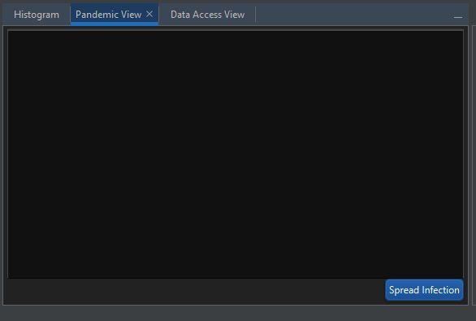

### 7.1.3: Listening to the Graph

We know our view will need the ability to listen to the graph, so that
we can react to changes in the outbreak data we are storing there. This
is achieved using the **GraphManagerListener** and
**GraphChangeListener** classes, which will provide you with the chance
to react as the graph changes.

```java
public final class PandemicViewTopComponent extends TopComponent implements GraphManagerListener, GraphChangeListener {
    ...
    @Override
    public void newActiveGraph(final Graph graph) {
        ...
    }

    @Override
    public void graphOpened(final Graph graph) {
        ...
    }

    @Override
    public void graphClosed(final Graph graph) {
        ...
    }

    @Override
    public void graphChanged(final GraphChangeEvent event) {
        ...
    }
}
```

Next up we need to define what happens when we detect a change. To do
this, we will use the **graphChanged** method to see if the change
affected the outbreak attribute, and update our view if necessary.

```java
private long outbreakModificationCounter = 0;
private Graph currentGraph = null;

@Override
public void graphChanged(final GraphChangeEvent event) {
    final ReadableGraph readableGraph = currentGraph.getReadableGraph();
    try {
        final int outbreakAttributeId = PandemicConcept.VertexAttribute.OUTBREAK.get(readableGraph);
        final long currentOutbreakModificationCounter = readableGraph.getValueModificationCounter(outbreakAttributeId);

        if (currentOutbreakModificationCounter > outbreakModificationCounter) {
            outbreakModificationCounter = currentOutbreakModificationCounter;
            pandemicPane.refresh(readableGraph);
        }
    } finally {
        readableGraph.release();
    }
}
```

In order for this system to work, we need to keep track of the current
active graph in order to listen to it. We also need to track the value
for the modification counter for the outbreak attribute. We can handle
all of this using the **newActiveGraph** method.

```java
@Override
public void newActiveGraph(final Graph graph) {
    if (currentGraph != graph) {
        if (currentGraph != null) {
            currentGraph.removeGraphChangeListener(this);
            currentGraph = null;
        }

        if (graph != null) {
            currentGraph = graph;
            currentGraph.addGraphChangeListener(this);
            final ReadableGraph readableGraph = currentGraph.getReadableGraph();
            try {
                final int outbreakAttributeId = PandemicConcept.VertexAttribute.OUTBREAK.get(readableGraph);
                outbreakModificationCounter = readableGraph.getValueModificationCounter(outbreakAttributeId);
            } finally {
                readableGraph.release();
            }
        }
    }
}
```

Remove any code from the **graphOpened** and **graphClosed** methods as
we don't wish to perform any operation for these events.

Finally, we should register our top component to **GraphManager** as a
listener.

```java
public PandemicViewTopComponent() {
...
GraphManager.getDefault().addGraphManagerListener(PandemicViewTopComponent.this);
}

@Override
public void componentOpened() {
    GraphManager.getDefault().addGraphManagerListener(this);
    newActiveGraph(GraphManager.getDefault().getActiveGraph());
}

@Override
public void componentClosed() {
    GraphManager.getDefault().removeGraphManagerListener(this);
}
```

Observe the behaviour of your new Pandemic view within Constellation.
Note that the text field will initially be empty and will only update
when the 'Outbreak' attribute is changed, either by running the 'Spread
Infection' plugin, or by manually editing the 'Outbreak' attribute.


**Simplified Graph Listening Framework**

While monitoring and responding to the various modification counters on
a graph is immensely flexible, it can also quite quickly become
overwhelming for more complex views. For this reason, Constellation also
provides a higher level framework which simplifies the interaction
between a view and the graph. This framework abstracts away from the
idea of counters on the graph, instead asking you to concentrate more on
how your view should behave.

-   A **monitor** defines which part of the graph you wish to listen to,
    such as an attribute or the structure of the graph itself.

-   A **listener** defines what action to take when a change occurs.

-   A **transition filter** defines the types of changes you care about.
    These changes are defined by transitions between states, and are
    defined as follows:


Once you have defined these concepts, they can all be managed using a
**monitor manager**.

## Exercise 7.2: Improved PANDEMIC view

Let's simplify our view from the previous exercise using the simplified
listening framework. We again start by creating a **TopComponent** class
and a pane to display within our top component (although we can re-use
the pane we created in the previous exercise here).

```java
@ConvertAsProperties(...)
@TopComponent.Description(...)
@TopComponent.Registration(...)
@ActionID(...)
@ActionReferences(...)
@TopComponent.OpenActionRegistration(...)
@Messages(...)
public final class ImprovedPandemicViewTopComponent extends TopComponent {
    private JFXPanel container;
    private PandemicViewPane pandemicPane;
    public ImprovedPandemicViewTopComponent () {
        setName(...);
        setToolTipText(...);
        initComponents();
        setLayout(new BorderLayout());
        setPreferredSize(new Dimension(500, 500));
        container = new JFXPanel();
        Platform.setImplicitExit(false);
        Platform.runLater(() -> {
            pandemicPane = new PandemicViewPane();
            container.setScene(new Scene(pandemicPane));
            container.getScene().getStylesheets().add(JavafxStyleManager.getMainStyleSheet());
            add(container, BorderLayout.CENTER);
        });
    }
    ...
}
```

### 7.2.1: Creating a Monitor Manager

Now we will create a **MonitorManager** to manage all the graph
listening for us. This class can be initialised with an optional counter
indicating how many times you expect the class to be started, which is
often useful if you could be starting it from more than one thread.
Since we could be initialising our monitor manager from either the swing
thread of the top component or the JavaFX thread of our pane, we will
initialise it with a counter of 2.

```java
private final MonitorManager manager;
public ImprovedPandemicViewTopComponent() {
    ...
    manager = new MonitorManager(2);
}
```

### 7.2.2: Creating a Monitor

We can then define the behaviour of our listener, starting with the
monitor. Since we are only interested in changes in the value of the
outbreak attribute, we should create an **AttributeValueMonitor** class.

```java
private final AttributeValueMonitor outbreakMonitor;
public ImprovedPandemicViewTopComponent() {
    ...
    outbreakMonitor = new
    AttributeValueMonitor(PandemicConcept.VertexAttribute.OUTBREAK);
}
```

### 7.2.3: Creating a Listener

Lastly we need to define the behaviour of our listener when a change
occurs. This is done using the **MonitorListener** class.

```java
private final MonitorListener listener;
public ImprovedPandemicViewTopComponent() {
    ...
    listener = (monitorManager, monitor, graph, newGraph, updateCount) -> {
        pandemicPane.refresh(graph);
    };
}
```

### 7.2.4: Creating a Transition Filter

The next thing to define is our transition filter which is done using
the **MonitorTransitionFilter** class. This class simply needs to be
constructed with a list of **MonitorTransition** states you wish to
respond to.

```java
private final MonitorTransitionFilter transitionFilter;
public ImprovedPandemicViewTopComponent() {
    ...
    transitionFilter = new MonitorTransitionFilter(MonitorTransition.UNDEFINED_TO_PRESENT, MonitorTransition.CHANGED,
            MonitorTransition.ADDED, MonitorTransition.REMOVED_AND_ADDED
);
}
```

### 7.2.5: Registering a Monitor

Now it's just a matter of registering our monitor, transition filter,
and monitor listener to our monitor manager, and starting it. Note that
we are starting the monitor manager when the view is opened and stopping
it when the view is closed to prevent unnecessary operations from being
handled when the user is not using the view.

```java
public ImprovedPandemicViewTopComponent() {
    ...
    manager.addMonitorListener(listener, transitionFilter, outbreakMonitor);
    Platform.runLater(() -> {
        ...
        manager.start();
    });
}

@Override
public void componentOpened() {
    manager.start();
}

@Override
public void componentClosed() {
    manager.stop();
}
```

Launch Constellation and observe that this simplified view has the same
behaviour as our previous view.

**Generic View Framework**

There is one more level of abstraction available to help simplify
creating a view in Constellation. The generic view framework is built on
the assumption that there is a large amount of overlap between the graph
listening behaviour of views in Constellation -- things like responding
to selection is almost always required for example. Creating a view
using this framework is simply a matter extending one of the
**AbstractTopComponent** classes instead of the Netbeans
**TopComponent** class.

-   The **ListeningTopComponent** takes care of all the standard graph
    listening patterns that all views require, and provides a simplified
    interface for adding new listening behaviours.

-   The **SwingTopComponent** builds on the **ListeningTopComponent**,
    providing a simplified interface for adding and managing Swing GUI
    elements.

-   The **JavaFxTopComponent** builds on the **ListeningTopComponent**,
    providing a simplified interface for adding and managing JavaFX GUI
    elements.

Using the generic view framework additionally has the advantage of
standardised behaviour across views -- that is, if there is an issue
with your view, then it is likely an issue for all other views using the
framework.

## Exercise 7.3: Generic PANDEMIC view

We will now simplify our view further by making use of the generic view
framework.

### 7.3.1: Creating a Generic Top Component

To create a view using the generic top component framework, you should
start by creating a regular Netbeans top component, and then change it
to extend a class within the framework.

```java
@ConvertAsProperties(...)
@TopComponent.Description(...)
@TopComponent.Registration(...)
@ActionID(...)
@ActionReferences(...)
@TopComponent.OpenActionRegistration(...)
@Messages(...)
public final class GenericPandemicViewTopComponent extends JavaFxTopComponent<PandemicViewPane> {
    public GenericPandemicViewTopComponent() {
        setName(...);
        setToolTipText(...);
        initComponents();
    }
    ...
}
```

### 7.3.2: Adding Content

From here you\'ll need to implement a few abstract methods (these will
change depending on which top component type you choose). For the
**JavaFxTopComponent** top component, we will need to specify some
JavaFX content to display and optionally a stylesheet to use. We should
also initialise the content, which tells the framework to fit it into
the top component in a standardised way.

```java
private PandemicViewPane pandemicPane;
public GenericPandemicViewTopComponent() {
    ...
    pandemicPane = new PandemicViewPane();
    initContent();
}

@Override
protected PandemicViewPane createContent() {
    return pandemicPane;
}

@Override
protected String createStyle() {
    return null;
}
```

### 7.3.3: Adding Listeners

Next we should add our listeners. The framework provides a range of
methods for adding various types of listeners -- refer to the javadoc
for more information on what\'s available. In our case, we need to
listen to the outbreak attribute, so we will make use of the
**addAttributeChangeHandler**() method, which asks us to map an
attribute to a handler.

```java
private PandemicViewPane pandemicPane;
public GenericPandemicViewTopComponent () {
    ...
    addAttributeChangeHandler(PandemicConcept.VertexAttribute.OUTBREAK, graph -> {
        final ReadableGraph readableGraph = graph.getReadableGraph();
        try {
            pandemicPane.refresh(readableGraph);
        } finally {
            readableGraph.release();
        }
    });
}
```

### 7.3.4: Handling Changes

Finally, we can optionally add handlers for when the state of the view
or graph changes (such as when the view is opened or the active graph is
changed). Once again the framework provides a range of methods allowing
you to account for these sorts of cases -- refer to the javadoc for more
information on what\'s available. In our case, we will override the
**handleComponentOpened**() method in order to have the view update
immediately by calling **manualUpdate**() to manually fire our outbreak
attribute change handler.

```java
@Override
public void handleComponentOpened() {
    manualUpdate();
}
```

Once again, launch Constellation and observe that this generic view has
the same behaviour as our two previous views.

And that\'s it! We\'ve now created a view capable of assisting our
analysis, and responding to changes in the graph in around 100 lines of
code.

# Chapter 8: User Interaction

We have now covered all that Constellation has to offer in terms of
creating and extending features for data analysis. The final touch is
knowing how to advertise these creations to your users, and how to
monitor their use.

## Exercise 8.1: What's New

When you first launch Constellation, by default, you will be presented
with the **Tutorial Page**. This page acts as a hybrid 'welcome screen'
and 'getting started' document. The pane on the right of the Tutorial
Page contains a reverse chronological list of changes and updates which
have occurred over the last month known as the What's New section. As a
developer, you can add to this section as you please.

### 8.1.1: Building a What's New Provider

Before we can add our own 'what's new' entries, we need to build a
**WhatsNewProvider** class, which Constellation will use to locate them.
This class simply needs to define the location of the file containing
your 'what's new' entries and the section (or category) these entries
belong to.

```java
@ServiceProvider(service = WhatsNewProvider.class)
public class PandemicWhatsNewProvider extends WhatsNewProvider {

    @Override
    public String getResource() {
        return "whatsnew.txt";
    }

    @Override
    public String getSection() {
        return "Pandemic";
    }
}
```

### 8.1.2: Adding What's New Entries

'What's new' entries are stored as formatted strings in a text document
within the Constellation code base. Let's open up the 'whatsnew.txt'
file now and take a look at its format.

The string format for a 'what's new' entry must begin with a line of the
form:

**== \<date formatted as yyyy-MM-dd\> \<title of what's new entry\>**

This can then be followed by any text, noting that HTML formatting is
respected.

The first example 'what's new' entry is of particular interest as it
demonstrates how to create a **sticky post**. This is simply achieved by
setting the date of the entry to any date after the year 3000. You'll
notice there is also an example of how to link to internal help
documentation.

Try adding some of your own 'what's new' entries to the 'whatsnew.txt'
file and observe how they are rendered in Constellation. Notice the
coloured badges that appear beside the title of each entry indicating
the module that entry belongs to and whether or not it is a recent
entry.

## Exercise 8.2: Help

Constellation makes use of a custom framework for providing help 
documentation. We are not going to go into too much detail on how this works, 
but to get you started let's jump into an example.

### 8.2.1: Writing a Help Page

Help pages in Constellation are simply Markdown (MD) documents. Open
'import-custom-cities.md' and take a look at its format. You can find this 
file located within the release/modules/ext/docs folder (after navigating a 
few additional sub-folders). Note that because of its location, you won't 
find the file from the *Projects* tab of Netbeans. You will need to switch to 
the *Files* tab in order to find it.

As you will see, this is just a very simple MD document. If you are unfamiliar 
with Markdown syntax, there are plenty of online resources which will go through 
that (so we won't cover that here). No specific syntax is required though to add 
text generally (syntax will only become important if you want to format text or 
add additional features). Feel free to add any text you wish to it now to see how 
it looks within Constellation.

### 8.2.2: Hooking into the Help Framework

Constellation uses a couple of files to find and organise help documents.
Let's go through those now.

-   **PandemicHelpProvider.java**: This is the *help page provider* file. 
	Located in the base package of the Training Exercises module, this 
	file outlines the details how to map your help pages into the help 
	framework. In it are two overwritten functions:
	-	***getHelpMap()***: This function allows us to specify unique id's
		for our help pages, and then map those id's to the actual MD file 
		locations. The id's are important as they are what is used when you 
		want to specify opening a particular help page (e.g. creating a
		button which when clicked opens up a help page). For some existing 
		parts of Constellation, there will already be an expectation on the 
		format of the id. e.g. For Data Access Plugins, the id needs to 
		match the full class name of the plugin in order for the blue help 
		button to open the correct help page.
	-	***getHelpTOC()***: This function allows us to specify the location
		of the table of contents file for this module.

-   **pandemic-toc.xml**: This is the *table of contents* document,
    which allows us to specify headings, groupings and order for our set
    of help documents. This file is located alongside the module's help 
	pages in the release/modules/ext/docs folder.

You won't need to make any changes here, so try launching Constellation
and finding the 'Import Custom Cities' help page.

### 8.2.3: Adding a Help Button

As mentioned in the previous exercise, one of the things you might like to 
do is add a help button to your functionality in order to provide users an 
easy way to access help information. You may have already seen in an earlier 
exercise that if you clicked on the help button next to Import Custom Cities 
in Data Access View, it would open the help page for that plugin. We're now 
going to add a similar button to the PandemicViewPane from Chapter 7 so that 
when clicked we will be able to immediately open the help page for the 
Pandemic View.

Open up the PandemicViewPane from Chapter 7 and add the following code to 
the constrcutor.

```java
public PandemicViewPane() {
    ...
    final Button helpButton = new Button("", new ImageView(UserInterfaceIconProvider.HELP.buildImage(16, ConstellationColor.SKY.getJavaColor())));
	helpButton.paddingProperty().set(new Insets(2, 0, 0, 0));
	helpButton.setTooltip(new Tooltip("Display help for Pandemic View"));
	helpButton.setOnAction(event -> new HelpCtx(PandemicViewPane.class.getName()).display());
	...
	// modify the add call on options to addAll
	options.getChildren().addAll(infectButton, helpButton);
	...
}
```

The parameter we are passing to the HelpCtx object is the help id of the 
page that we want open, namely the Pandemic View help page. It is important 
that this value matches what we have specified in the help provider file and 
the toc file. If not, the button will open the default help page (About 
Constellation) if it can't match the id given.

So go ahead and give that a try. When you open one of the Pandemic Views we
created earlier, you should now see a help button next to Spread Disease 
button. When you click on that button, it should bring up the Pandemic 
View help page.

## Exercise 8.3: Logging

By default, Constellation will not perform any logging for you, but
there is an extensible **logging framework** available for any developer
to implement. This framework will create log entries at the following
points in Constellation's lifecycle:

-   When Constellation is launched

-   When a plugin begins execution

-   During a plugins' execution

-   When a plugin throws an exception

-   When a plugin finishes execution

-   When Constellation is closed

The logging framework allows for any number of **log consumers** to
collect and forward information at any of these points.

### 8.3.1: Building a Logger

To register a new log consumer, you simply need to create a
**ConstellationLogger** class. This will provide you with a number of
methods to implement:

-   **applicationStart** and **applicationStop** allow you to create a
    log when Constellation is launched or closed. These are called
    automatically by Constellation.

-   **pluginStart** and **pluginStop** allow you to create a log when
    Constellation begins or ends execution of a plugin. These are called
    automatically by Constellation's plugin framework.

-   **pluginError** allows you to create a log when an exception is
    thrown by a plugin in Constellation. This is called automatically by
    Constellation's plugin framework.

-   **pluginInfo** and **pluginProperties** allow you to create a log
    when a plugin submits some information. These methods are generally
    implemented in a way specific to an individual plugin and are
    usually used to facilitate the logging of intermediate plugin
    information.

To make things a little simpler, there also exists the
**DefaultConstellationLogger** class, which implements all of the above
methods but takes no action for any of them. By extending this class you
can choose to only submit logs for the specific lifecycle points which
interest you. Try creating your own log consumer now which simply prints
to the console for the **applicationStart**, **applicationStop**,
**pluginStart** and **pluginStop** methods.

### 8.3.2: Using the Delegating Logger

If you wish to have multiple log consumers (say, one which prints to
console and one which stores logs in a database) you can make use of the
**DelegatingConstellationLogger** class to allow all your log consumers
the opportunity to create logs. This class is simply a
**ConstellationLogger** class itself, which looks up all other log
consumers and asks them all to create a log.

To use the **DelegatingConstellationLogger** class, you simply need to
ensure it is the default log consumer. The default log consumer is
decided by comparing the position of all registered log consumers (which
is optionally specified in the **ServiceProvider** annotation). The
**DelegatingConstellationLogger** has a position of 0, so as long as all
your log consumers have a position higher than this, it will be the
default log consumer.

Try creating a second log consumer which simply prints different
messages than your first log consumer. Don't set a position attribute on
either of your log consumers (which will give them a default position of
Integer**.***MAX_VALUE*) to ensure the **DelegatingConstellationLogger**
is active. Launch Constellation and observe the output.

It is worth noting that using multiple loggers can result in a
performance penalty. To prevent this, it is recommended that you do not
perform any long running operations inside the methods provided by
**ConstellationLogger**. This can be worked around by queuing any long
running operations and performing them later.

### 8.3.3: Logging a Plugin

In this section, we will use our new log consumer to accept logs from a
plugin. Start by opening the **ChainCitiesPlugin** class from Chapter 4.
We will update this to provide more information about the execution of
our Chain Cities plugin. Add the following code to the query method,
directly before the return statement:

```java
...
ConstellationLogger.getDefault().pluginInfo(this, "Successfully queried " + query.size() + " cities.");
final Properties loggingProperties = new Properties();
loggingProperties.setProperty("ResultCount", String.valueOf(result.size()));
ConstellationLogger.getDefault().pluginProperties(this, loggingProperties);
...
```

The code above first submits a simple information string to the logging
system stating how many cities have been queried. Note that there is
only one value recorded for plugin info. Subsequent calls to this method
during a single plugin execution will over-write previous calls. The
subsequent code creates a Java properties object with a key-value pair
recording the number of flights we added to the graph. The properties
object is then passed to the logging system as the plugin properties
object. Again, while the properties object can hold as many key-value
pairs as required, only a single plugin properties object is recorded
for each plugin execution. Subsequent calls will over-write any previous
calls.

Note that in this case we are logging using the **pluginProperties**
method, which our current log consumers do not handle. Try overriding
this method in one of your log consumers to print all properties to the
console, and then run this plugin and observe the behaviour.

### 8.3.4: Logging to a file

The logging framework enables logging with plugins which is useful but
sometimes you just want to log to a file. NetBeans has preconfigured
routing to write to var/log/messages.log relative to the --userdir
passed in when you use java.util.logging.Logger. Therefore the
recommended approach to log would be to use Logger opposed to
System.out.println.

```java
...
private static final Logger LOGGER = Logger.getLogger(OutbreakUtilities.class.getName());
...
LOGGER.log(Level.INFO, "Flights: {0}", flightCount);
```

By default the lowest level of logging is "info". To be able to log
"fine", "finer" and "finest" you have to pass that as an argument when
launching Constellation like so:

constellation64.exe
--J-Dau.gov.asd.tac.constellation.training.solutions.OutbreakUtilities.level=FINE

# Chapter 9: Extras

We have now added a huge number of features to Constellation in order to
fully enable analysis of a pandemic. However, this guide has not yet
covered all of the ways in which Constellation can be extended. This
chapter will explore some other ways Constellation can be built upon.
Please refer to the Training Solutions module suite for source code and
other resources related to this chapter.

**Conversation View**

The Conversation View allows you to view any data you might define as
content (text, images, audio, video, etc.) in a chronological flow, as
if a conversation was occurring. By default, it will render any text
which appears in the 'Content' transaction attribute, but you can add
your own **ConversationContributionProvider** classes to add new types
of content to the conversation.

A valid conversation contribution requires 2 things -- a check that the
graph is relevant to this conversation contribution, and the logic for
building the contribution. The contribution that is built should be a
**ConversationContribution** object.

```java
@ServiceProvider(service = ConversationContributionProvider.class)

public class IconContributionProvider extends ConversationContributionProvider {
    private final SchemaAttribute iconAttribute = VisualConcept.VertexAttribute.FOREGROUND_ICON;
    private final SchemaAttribute flightAttribute = VisualConcept.TransactionAttribute.AIRLINE;

    public IconContributionProvider() {
        super("Icons", Integer.MAX_VALUE);
    }

    @Override
    public boolean isCompatibleWithGraph(final GraphReadMethods graph) {
        return iconAttribute.get(graph) != GraphConstants.NOT_FOUND 
		        && flightAttribute.get(graph) != GraphConstants.NOT_FOUND;
    }

    @Override
    public ConversationContribution createContribution(final GraphReadMethods graph, final ConversationMessage message) {
        final int iconAttributeId = iconAttribute.get(graph);
        final int senderId = message.getSender();
        final ConstellationIcon senderIcon = graph.getObjectValue(iconAttributeId, senderId);

        final int flightAttributeId = flightAttribute.get(graph);
        final int transactionId = message.getTransaction();
        final String flight = graph.getStringValue(flightAttributeId, transactionId);

        return new IconContribution(message, senderIcon, flight);
    }

    private class IconContribution extends ConversationContribution {
        private final ConstellationIcon icon;
        private final String flight;

        public IconContribution(final ConversationMessage message, final ConstellationIcon icon, final String flight) {
            super(IconContributionProvider.this, message);
            this.icon = icon;
            this.flight = flight;
        }

        @Override
        protected Region createContent(final TooltipPane tips) {
            final VBox content = new VBox();
            final ImageView iconImage = new ImageView(icon.buildImage());
            final SelectableLabel iconLabel = new SelectableLabel(flight, true, null, tips, null);
            content.getChildren().addAll(iconImage, iconLabel);
            return content;
        }

        @Override
        public String toString() {
            return "Icon Contribution";
        }
    }
}
```

**Map View**

The Map View provides a geospatial view of the data in a graph. It comes
complete with a basic set of base maps, tools and exporters, but these
can be easily added to.

New base maps can be made available to the Map View by registering a
**MapProvider** class. Given a coordinate (x, y), this class simply
needs to return a tile image to place there, either from a local or
network source. Below is an example of retrieveing tiles from a local
database.

```java
@ServiceProvider(service = MapProvider.class)
public class BlackAndWhiteMapProvider extends MapProvider {

    @Override
    public String getName() {
        return "Black & White";
    }

    @Override
    public int zoomLevels() {
        return 6;
    }

    @Override
    public String getZoomString(final Coordinate coordinate) {
        final float gridSize = PApplet.pow(2, coordinate.zoom);
        final float negativeRow = gridSize - coordinate.row - 1;
        return (int) coordinate.zoom + "/" + (int) coordinate.column + "/" + (int) negativeRow;
    }

    @Override
    public PImage getTile(final Coordinate coordinate) {
        final File blackAndWhiteMap = ConstellationInstalledFileLocator.locate(",odules/ext/Black&White.mbtiles", 
		        "au.gov.asd.tac.constellation.training.solutions", false, 
				BlackAndWhiteMapProvider.class.getProtectionDomain());
        final String connection = String.format("jdbc:sqlite:%s", blackAndWhiteMap.getAbsolutePath());

        final int zoom = (int) coordinate.zoom;
        final float gridSize = PApplet.pow(2, coordinate.zoom);
        final float negativeRow = gridSize - coordinate.row - 1;
        final int row = (int) negativeRow;
        final int column = (int) coordinate.column;
        return MBTilesLoaderUtils.getMBTile(column, row, zoom, connection);
    }

    @Override
    public String[] getTileUrls(final Coordinate coordinate) {
        return null;
    }
}
```

New tools can be overlaid on the Map View by registering a
**MapOverlay** class. An overlay is built on top of the Processing
framework, which provides a high level API for rendering on your
graphics card, and simply asks you to define what to draw on screen and
how to handle mouse and keyboard events.

```java
@ServiceProvider(service = MapOverlay.class)
public class MousePositionOverlay extends MapOverlay {
    private boolean mousePressed = false;

    @Override
    public float getName() {
        return "Mouse Position Overlay";
    }

    @Override
    public float getX() {
        return renderer.getX() + renderer.getWidth() - 10 - width;
    }

    @Override
    public float getY() {
        return renderer.getY() + renderer.getHeight() - 10 - height;
    }

    @Override
    public void overlay() {
        renderer.noStroke();
        renderer.fill(mousePressed ? HIGHLIGHT_COLOR : BACKGROUND_COLOR);
        renderer.rect(x, y, width, height);
        float yOffset = y + margin;
        final String mouseX = String.valueOf(renderer.mouseX) + "px";
        final String mouseY = String.valueOf(renderer.mouseY) + "px";
        drawLabel("Mouse", x + 60, yOffset);
        drawValue(mouseX, x + 60, yOffset, valueBoxMediumWidth, false, false);
        drawValue(mouseY, x + 60 + valueBoxMediumWidth + padding, yOffset,
        valueBoxMediumWidth, false, false);
    }

    @Override
    public void mouseMoved(final MouseEvent event) {
    }

    @Override
    public void mouseClicked(final MouseEvent event) {
    }

    @Override
    public void mousePressed(final MouseEvent event) {
        mousePressed = true;
    }

    @Override
    public void mouseDragged(final MouseEvent event) {
    }

    @Override
    public void mouseReleased(final MouseEvent event) {
        mousePressed = false;
    }

    @Override
    public void mouseWheel(final MouseEvent event) {
    }

    @Override
    public void keyPressed(final KeyEvent event) {
    }
}
```

New exporters can be added to the Map View by registering a
**MapExporter** class. For convenience, you can also choose use the
**AbstractGeoExportPlugin** class, which implements **MapExporter** but
takes care of all the logic surrounding extracting geo data from the
graph

```java
@ServiceProviders({
    @ServiceProvider(service = MapExporter.class),
    @ServiceProvider(service = Plugin.class)
})
@NbBundle.Messages("TextGeoExporter=Export to Text")
@PluginInfo(pluginType = PluginType.EXPORT, tags = {"EXPORT"})
public class TextGeoExporter extends AbstractGeoExportPlugin {

    @Override
    protected FileChooser.ExtensionFilter getExportType() {
        return new FileChooser.ExtensionFilter("TEXT", "*txt");
    }

    @Override
    protected void exportGeo(final PluginParameters parameters, final String uuid, final Map<String, String> shapes, 
	        final Map<String, Map<String, Object>> attributes, final File output) throws IOException {
        for (final String id : shapes.keySet()) {
            final String shape = shapes.get(id);
            try (final FileWriter writer = new FileWriter(output)) {
                writer.write(String.format("%s=%s\n", id, shape));
            }
        }
    }

    @Override
    public String getDisplayName() {
        return "Text";
    }

    @Override
    public String getPluginReference() {
        return this.getClass().getName();
    }
}
```

**Analytic View**

The Analytic View provides a way to calculate and visualise analytic
results from a graph as well as have those results interact with that
graph. It comes pre-packaged with a wide range of analytic plugins, and
of course you can also add your own.

An analytic plugin is defined by writing an **AnalyticPlugin** class.
You can also use one of the higher-level analytic plugin classes:

-   A **ScoringAnalyticPlugin** assigns scores to graph elements based
    on a specified attribute after running a specified plugin.

-   A **MultiScoringAnalyticPlugin** assigns multiple scores to graph
    elements based on a specified attribute after running a specified
    plugin.

-   A **ClusterAnalyticPlugin** assigns cluster numbers to both nodes
    and transactions based on a set of specified attributes after
    running a specified plugin.

-   A **GraphAnalyticPlugin** records whole-of-graph scores based on a
    set of specified attributes after running a specified plugin.

```java
@ServiceProviders({
    @ServiceProvider(service = Plugin.class),
    @ServiceProvider(service = AnalyticPlugin.class)
})
@NbBundle.Messages("OutbreakCountAnalytic=Outbreak Count Analytic")
@PluginInfo(tags = {"ANALYTIC"})
@AnalyticInfo(analyticCategory = "Count")
public class OutbreakCountAnalytic extends AnalyticPlugin<ScoreResult> {

    protected ScoreResult result;

    @Override
    public Set<SchemaAttribute> getPrerequisiteAttributes() {
        final Set<SchemaAttribute> attributes = new HashSet<>();
        attributes.add(PandemicConcept.VertexAttribute.OUTBREAK);
        return attributes;
    }

    @Override
    protected final void edit(final GraphWriteMethods graph, final PluginInteraction interaction, 
	        final PluginParameters parameters) throws InterruptedException, PluginException {
        result = new ScoreResult();

        final int identifierAttributeId = VisualConcept.VertexAttribute.IDENTIFIER.get(graph);
        final int outbreakAttributeId = PandemicConcept.VertexAttribute.OUTBREAK.get(graph);
        final int outbreakCountAttributeId = PandemicConcept.VertexAttribute.OUTBREAK_COUNT.ensure(graph);

        PluginExecution.withPlugin(PandemicPluginRegistry.SPREAD_INFECTION).executeNow(graph);

        final int vertexCount = graph.getVertexCount();
        for (int vertexPosition = 0; vertexPosition < vertexCount; vertexPosition++) {
            final int vertexId = graph.getVertex(vertexPosition);
            final Outbreak vertexOutbreak = graph.getObjectValue(outbreakAttributeId, vertexId);
            if (vertexOutbreak != null) {
                final String identifier = graph.getStringValue(identifierAttributeId, vertexId);
                final float score = vertexOutbreak.getNumberOfDiseases();
                final boolean isNull = score == (int) graph.getAttributeDefaultValue(outbreakCountAttributeId);
                result.add(new ScoreResult.ElementScore(GraphElementType.VERTEX, vertexId, identifier, isNull, score));
            }
        }
    }

    @Override
    public Set getAnalyticAttributes(final PluginParameters parameters) {
        final Set<SchemaAttribute> attributes = new HashSet<>();
        attributes.add(PandemicConcept.VertexAttribute.OUTBREAK_COUNT);
        return attributes;
    }

    @Override
    public ScoreResult getResults() {
        return result;
    }

    @Override
    public Class<? extends AnalyticResult> getResultType() {
        return ScoreResult.class;
    }
}
```

Each analytic plugin must specify an **AnalyticResult** which determines
the type of output the analytic produces. For example, the
**ScoringAnalyticPlugin** uses a **ScoreResult** which records a score
against a graph element, whereas the **GraphAnalyticPlugin** uses a
**GraphResult** which records a score against a graph.

The results of analytic plugins can be aggregated together using an
**AnalyticAggregator** class. This allows you to build more complex
analytics by combining the results of simpler analytics. An analytic
aggregator is valid for your analytic if it supports the same result
type as your analytic.

Once you have one or more analytic plugins, you can create an
**AnalyticQuestionDescription** class to represent a question you might
ask of the graph. This class asks you to define the analytic plugins
which will answer your question, values for the parameters of those
plugins, and the method for aggregating the results in order to create a
pre-set analytic for users to run. Note that the analytic plugins
specified must use the same result type in order for them to be
aggregated.

```java
@ServiceProvider(service = AnalyticQuestionDescription.class)
public class HowManyOutbreaksQuestion implements AnalyticQuestionDescription {

    @Override
    public String getName() {
        return "How many outbreaks?";
    }

    @Override
    public String getDescription() {
        return "Counts the number of outbreaks per city";
    }

    @Override
    public List<Class<? extends AnalyticPlugin<ScoreResult>>> getPluginClasses() {
        return Arrays.asList(OutbreakCountAnalytic.class);
    }

    @Override
    public Class<? extends AnalyticAggregator<ScoreResult>> getAggregatorType() {
        return SumScoreAggregator.class;
    }

    @Override
    public Class<? extends AnalyticResult> getResultType() {
        return ScoreResult.class;
    }

    @Override
    public void initialiseParameters(final AnalyticPlugin plugin, final PluginParameters parameters) {
    }
}
```

When an analytic plugin or question is run in the Analytic View, the
result can be displayed within the Analytic View using an
**InternalVisualisation** class or within the graph using a
**GraphVisualisation** class. The Analytic View is able to automatically
pick appropriate visualisations based on the result type of the analytic
run by using the **InternalVisualisationTranslator** and
**GraphVisualisationTranslator** classes, which define the logic for
translating a result type to a visualisation.

**Schema View**

The Schema View provides information about or related to the schema of
the current graph. By default, the Schema View reveals information about
attributes, vertex types, transaction types and plugins, but of course
you can add more information using a **SchemaViewNodeProvider** class.

```java
@ServiceProvider(service = SchemaViewNodeProvider.class)
public class PandemicNodeProvider implements SchemaViewNodeProvider {
    private static final String INFO = "<Information about pandemics goes here>";

    @Override
    public void setContent(final Tab tab) {
        final VBox node = new VBox();
        final Label pandemicInfo = new Label(INFO);
        node.getChildren().add(pandemicInfo);

        Platform.runLater(() -> {
            tab.setContent(node);
        });
    }

    @Override
    public void discardNode() {
    }

    @Override
    public String getText() {
        return "Pandemic Info";
    }
}
```

# Chapter 10: Useful Links

Some useful reference links that one should be across are as follows:

-   http://wiki.netbeans.org/FaqIndex

-   http://wiki.netbeans.org/NetBeansDeveloperFAQ

-   http://wiki.netbeans.org/NetBeansUserFAQ

-   https://netbeans.org/community/releases/82/relnotes.html

-   https://netbeans.org/community/releases/81/relnotes.html
